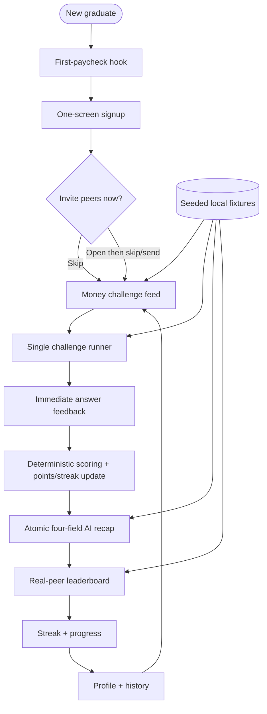

# feat: Duolingo Financial Literacy — Figma mockups and frontend replication

> **Target repo:** this repo, `financial-literacy-duolingo`. The repository is pre-build: there is no application scaffold or shipped frontend. This plan first creates an inspectable Figma prototype, then reproduces it as a React + Vite clickable demo using seeded data.
>
> **Plan relationship:** `docs/plans/origin.md` defines the product and MVP boundary; `docs/plans/features/*.md` defines the five feature families; `docs/design-system-2026-07-15.md` defines the control vocabulary; and `docs/plans/2026-07-15-002-refactor-e2e-ux-motion-audit-plan.md` is the UX, motion, accessibility, and E2E acceptance contract. This plan fills the former frontend-replication template and turns those inputs into a Figma-ready prompt plus an implementation sequence.

## Summary

v0.1 delivers a mobile-first mockup and clickable prototype for a new Duolingo financial-literacy course, internally codenamed finfy-literacy. The prototype leads a new graduate from a first-paycheck hook into a short financial challenge, immediate answer feedback, a strict four-field AI recap, an updated real-peer leaderboard, progress/streak tracking, and profile/account management. Existing components from the supplied Duolingo Community Figma files are reused before custom components are created. Mobbin free-tier references are optional production benchmarks, never copy targets or paid dependencies.

The first implementation pass is intentionally frontend-only: React + Vite, route navigation, seeded state, deterministic mock responses, loading/error/empty states, and the full E2E demo path. The future architecture is kept visible so the prototype can graduate without a redesign:

1. **Frontend:** React + Vite
2. **Backend:** Python (FastAPI)
3. **AI:** one pipeline (RAG/extraction/classification), specialized here as structured recap generation plus a lightweight classification/guardrail pass
4. **Storage:** SQLite
5. **Deploy:** Cloud Run

The hackathon demo sentence is:

> For new graduates receiving their first paycheck, Duolingo Financial Literacy turns a two-minute money lesson into immediate feedback, a trustworthy next step, and visible progress with friends.

The 30-second judge path is:

> Open first-paycheck challenge → answer one question → see points and strict AI recap → open leaderboard and see rank move.

---

## Problem Frame

New graduates are unusually motivated to learn when their first paycheck arrives, but existing financial-literacy resources are long, generic, and easy to abandon. The product must convert that brief motivation into a repeatable daily loop without looking like a budgeting dashboard, a bank onboarding funnel, or a chatbot.

The mockups must solve five connected pain points:

| Feature family | User pain | UI response | E2E consequence |
|---|---|---|---|
| Gamified challenges | Financial education feels dry and too large to start | Two-minute cards, one question per screen, visible progress, immediate feedback | The first useful action happens before setup fatigue |
| AI-generated summary | A score does not explain what to improve | Fixed four-field card: what you did, score, next step, track position | The user always leaves with one concrete learning action |
| Real-peer leaderboard | Learning has no reason to pull the user back | Named invited peers, highlighted current-user row, achievable point gap | Competition feels personal without exposing financial data |
| Onboarding/account | Forms consume the first-paycheck motivation window | One-screen signup, optional/skippable invite, direct first challenge | Time-to-first-challenge stays measured in minutes |
| Mobile-first shell | Sessions happen one-handed between other tasks | Thumb-reachable actions, persistent streak/points, bottom navigation | The complete loop fits one phone session |

The core experience must remain educational rather than advisory. No mockup may request bank credentials, balances, debt, income, transactions, or personalized investment decisions. Leaderboards show only learning points, streaks, and rank. AI copy is grounded in challenge performance and includes a calm education-not-advice note.

---

## Requirements

The requirements below combine the product feature documents with the forward audit contract.

### Product and flow

- **R1.** The first-paycheck hook is visible within the first viewport and routes to a real challenge, not a welcome tour.
- **R2.** Signup is one screen; peer invite is optional and never gates the first challenge.
- **R3.** Challenge content covers budgeting, saving, investing, and credit in one fixed MVP track.
- **R4.** A challenge is presented as a two-to-four-minute unit with one primary action and one question per quiz state.
- **R5.** Correct/incorrect feedback is immediate, specific, and does not auto-advance before it can be read.
- **R6.** Challenge completion updates points and streak before the recap is revealed.
- **R7.** Every recap uses exactly four fields in this order: what you did, score, next step, track position.
- **R8.** The recap renders only after the complete structured object is ready; no partial AI text streams into the fixed card.
- **R9.** A deterministic mock fallback uses the same four-field layout when AI is unavailable.
- **R10.** The leaderboard contains named, invited peers only; the signed-in user is highlighted and remains easy to locate.
- **R11.** A solo user sees personal progress plus an invite CTA, never a blank or anonymous leaderboard.
- **R12.** Progress shows streak, weekly consistency, points, and completed challenge history without badges or achievement shelves.
- **R13.** Profile is a progress home with account basics, not a settings dead end.
- **R14.** The complete demo flow is navigable with seeded data and no backend.

### Visual system and component reuse

- **R15.** Inspect and reuse instances from the supplied Duolingo Figma Community files before drawing custom equivalents.
- **R16.** Preserve a clear component grammar: squircle means interactive; pill means read-only metadata/status.
- **R17.** One solid primary CTA appears per screen; secondary actions are outlined or visually quiet.
- **R18.** Challenge cards, leaderboard rows, recap surfaces, and the profile summary share one elevation and scrim system.
- **R19.** Nested rounded elements use concentric radii; avatars and thumbnails use a subtle neutral outline.
- **R20.** Dynamic numeric values use tabular numerals.

### Interaction, motion, and accessibility

- **R21.** Interactive targets are at least 40×40 px and should use a 44×44 px hit area when the reference component permits it.
- **R22.** Pressed controls visibly scale to `0.96`; transitions name exact properties and never use `transition: all`.
- **R23.** Celebration elements begin in a synchronous pre-reveal state so no settled end state flashes before animation.
- **R24.** Invite/share overlays render over the active screen, trap focus, close by explicit control/Escape/backdrop, and restore focus to their trigger.
- **R25.** Animations remain interruptible; exits are simpler than entrances; repeated route visits do not replay first-load celebrations.
- **R26.** Every transition of 200 ms or more collapses to 80 ms or less under `prefers-reduced-motion: reduce`.
- **R27.** Text and non-text contrast meets WCAG 2.2 AA: 4.5:1 for normal text, 3:1 for large text and essential UI graphics.
- **R28.** The prototype remains usable by keyboard, screen reader, 200% text zoom, and 320 px-wide viewport.
- **R29.** Headings balance-wrap; body and empty-state copy pretty-wrap; the root uses antialiased font smoothing.
- **R30.** Loading, empty, error, offline/demo, and reduced-motion states are designed rather than deferred.

### Hackathon execution

- **R31.** The Figma prototype demonstrates the full core loop before frontend code begins.
- **R32.** The React demo supports cached/seeded outputs and a visible demo reset so it remains stage-safe.
- **R33.** The team can show one measurable proof point: time-to-first-challenge, completion steps, or strict-format pass rate across seeded cases.
- **R34.** Scope is cut rather than architecture expanded if the stable 30-second demo path is at risk.

**Origin actors:** new graduate; invited peer; hackathon judge; builder/operator.

**Origin flows:** first open → signup → optional invite → first challenge → answer feedback → challenge completion → strict recap → leaderboard → progress → profile → sign out/reset.

**Origin acceptance examples:** a cold user reaches a challenge without a mandatory questionnaire; a completed answer updates points; the recap always shows four settled fields; a no-peer state is useful; reduced motion removes the celebratory transform sequence.

---

## Scope Boundaries

- No personalized financial plan, recommendation, or real-money action.
- No bank, brokerage, payroll, or financial-institution integration.
- No balances, income, debt, transactions, or peer answers in the UI or fixtures.
- No anonymous global leaderboard, messaging, comments, or forum.
- No badges, achievement tree, cosmetic store, premium tier, or monetization.
- No adaptive difficulty or personalized track in the first prototype.
- No production auth, notification service, analytics warehouse, or multi-agent orchestration.
- No new component library when the linked Duolingo Figma assets already cover the need.
- No pixel-for-pixel copying of Mobbin screens; use them only to test hierarchy and interaction patterns.

### Deferred to Follow-Up Work

- Production FastAPI endpoints, SQLite schema/migrations, one-pipeline AI integration, and Cloud Run deployment.
- Tablet/desktop optimization beyond responsive QA frames.
- Native app, push notifications, localization, and advanced accessibility certification.
- Real peer invitations, account recovery, data export/delete execution, and privacy controls.
- Any AI video-call mascot or high-school course variant.

---

## Context & Research

### Repository findings

- The repository has documentation and six local Fingo references but no application scaffold, package manifest, or source implementation.
- `docs/plans/origin.md` makes the product judgment explicit: short challenges + real-peer leaderboard + strict-format AI recap.
- `docs/plans/features/gamified-challenges.md` requires short, checkable lessons across four fixed tracks.
- `docs/plans/features/ai-generated-summaries.md` owns the recap's fixed structure.
- `docs/plans/features/leaderboards-peer-competition.md` rejects anonymous ranking in favor of known peers.
- `docs/plans/features/onboarding-account-management.md` prioritizes low friction and direct entry to first value.
- `docs/plans/features/mobile-first-design.md` locks the first platform as a mobile-first responsive web app.
- `docs/design-system-2026-07-15.md` distinguishes interactive squircles from read-only pills and defines primary, secondary, tab, status, metadata, and rank roles.
- `docs/plans/2026-07-15-002-refactor-e2e-ux-motion-audit-plan.md` supplies concrete contracts for pre-reveal states, overlay stacking, elevation consistency, hit areas, tabular numbers, reduced motion, and full-flow screenshot verification.

### Local visual references

| File | Useful benchmark | Adaptation, not replication |
|---|---|---|
| `fingo-001.png` | Dense course feed, category shortcuts, persistent points/streak chrome, bottom nav | Reduce stat clutter; use four financial tracks and stronger locked/active/completed hierarchy |
| `fingo-002.png` | Short story lesson with a single Next action | Add progress label and a two-minute expectation; avoid long unbroken paragraphs |
| `fingo-003.png` | Single quiz, immediate correct state, sticky result tray | Preserve answer-then-feedback; improve semantic color/contrast and keyboard focus |
| `fingo-004.png` | Scenario/story question with character choices | Use hypothetical newgrad scenarios; never imply personalized investment advice |
| `fingo-005.png` | Reward reveal plus leaderboard-position preview | Replace generic reward screen with the strict four-field recap and guarded reveal motion |
| `fingo-006.png` | Named leaderboard, current-row highlight, friend actions | Keep real peers; use an achievable gap and solo/invite state; avoid weekly-reset implication in MVP |

### Figma source files

1. **Duolingo Design System (Community)** — file key `o8T9Kj8YwO3NMkG6xl5eXX`, starting node `24:482`: [open file](https://www.figma.com/design/o8T9Kj8YwO3NMkG6xl5eXX/DuoLingo-Design-System--Community-?node-id=24-482&m=dev&t=kxrALuqlCP4ZlYtq-1).
2. **Duolingo.com → Web Pages UI (Community)** — file key `ASFNUIHFp3LfP7wSRWXrtY`, starting node `0:1`: [open file](https://www.figma.com/design/ASFNUIHFp3LfP7wSRWXrtY/Duolingo.com-%E2%86%92-Web-Pages-UI--Community-?node-id=0-1&t=4LQYSegUInJwd8Uk-1).

The design agent must inspect these files through Figma MCP at execution time. Public web access confirms the files, but component inventories and variant properties must not be guessed from a flattened preview. When an exact component does not exist, compose a local component from inspected primitives and document the divergence.

### Mobbin free-tier benchmark

If Mobbin MCP/free-tier access is available without payment, use only free search and accessible screen metadata for 2–3 references per surface family. Start from `docs/audit/mobbin-references-2026-07-15.md`, which already records candidate patterns from Duolingo, Fingo, Zogo, Strava, Gentler Streak, Mimo, YNAB, and Monarch Money. Do not start a trial, bypass a paywall, or make Mobbin a blocking dependency. If access is unavailable, use the local reference brief plus the Figma files.

### Hackathon guidance applied

- The stack guide favors a boring, reliable stack, one AI pipeline, SQLite/local data, and a demo-mode fallback. This plan follows that guidance while using the user-required React + Vite and future FastAPI/SQLite/Cloud Run architecture.
- The research-to-market guidance is translated into a progression: prove the first-paycheck learning loop at the hackathon, record real usage evidence, then harden it toward a deployable pilot.
- The winning-hackathon guidance prioritizes a specific user, visible pain, smallest AI that matters, a stable one-screen-feeling product, and measurable proof.
- The 72-hour demo playbook prioritizes a clickable skeleton in the first six hours, controlled fixtures, strict outputs, cached fallbacks, polish, and rehearsal.

### External References

- **Hackathon Tech Stack Guide** — [Since AI](https://sinceai.ai/blog/hackathon-tech-stack-guide). Choose reliability and time-to-demo over architecture novelty.
- **Research to Market** — [Since AI](https://sinceai.ai/research-to-market). Frame the hackathon as real-world validation that can progress into production and commercialization.
- **How to Build a Demo in 72 Hours** — [Since AI](https://sinceai.ai/blog/how-to-build-a-demo-in-72-hours). Build the skeleton first, add one smart core, then reliability and proof.
- **How to Win an AI Hackathon** — [Since AI](https://sinceai.ai/blog/how-to-win-an-ai-hackathon). Make the problem, flow, proof, and pitch repeatable.

---

## Key Technical Decisions

1. **Figma is the visual contract; React is the replication target.** Build and approve the full Figma prototype before production-style component extraction. This prevents route code from becoming the design exploration surface. Affects R15–R20, R31.
2. **The app is a Duolingo course concept, with finfy-literacy retained only as the internal codename.** User-facing navigation calls the area **Money** or **Money Skills**; the project docs may continue using finfy-literacy. Affects R1–R4.
3. **One stable demo path outranks complete feature depth.** The route set can contain supporting screens, but the judged path remains challenge → feedback → recap → leaderboard. Affects R31–R34.
4. **The first run is frontend-only.** All score, points, recap, leaderboard, and account data comes from typed local fixtures and deterministic state transitions. No network request is required to complete the demo. Affects R14, R32.
5. **Future backend shape is FastAPI + SQLite, but no API abstraction is overbuilt in v0.1.** A thin repository interface may isolate fixtures, but production caching, auth, and persistence are deferred. Affects R14, R34.
6. **One AI pipeline, not five chained calls.** The future pipeline receives deterministic scoring and standings, creates the four recap fields, then applies schema/advice-language classification. The frontend mocks `loading | ready | fallback`; it never streams partial fields. Affects R7–R9.
7. **Invitation is optional and demonstrable from multiple entry points.** The default fast path skips it before the first challenge, while the prototype can open the same overlay from onboarding, leaderboard, and profile to validate stacking/focus. Affects R2, R10, R24.
8. **Mobile baseline is 390×844.** Also QA at 320×568, 430×932, 768×1024, and 1440×1024; only the phone frames require high-fidelity mockups in v0.1. Affects R21, R28.
9. **44 px interaction target is preferred even though the audit floor is 40 px.** Existing 40 px visual controls gain an invisible 44 px hit target where spacing permits. Affects R21.
10. **Motion communicates state rather than decorating navigation.** Correctness, points, streak, rank delta, recap reveal, and sheet transitions receive motion; initial page load and ordinary text do not. Affects R22–R26.

---

## Open Questions

### Resolved During Planning

- **Platform:** mobile-first responsive web, implemented with React + Vite.
- **Leaderboard cadence:** cumulative in MVP; do not imply a weekly reset in the primary mockup.
- **Peer cold start:** personal progress + invite CTA, not anonymous seeded strangers presented as real.
- **AI recap:** fixed four fields, rendered atomically, with deterministic same-layout fallback.
- **Invite timing:** optional before first challenge and promoted after first recap; it never gates first value.
- **Gamification scope:** points, streak, rank only; no badges/achievement shelf.
- **Primary demo scenario:** “Credit Utilization 101,” 4/6 correct, 40 points, one missed-concept next step, rank movement against named seeded peers.

### Deferred to Implementation

- Exact component and variant names in the Community Figma libraries; resolve by MCP inspection and record in the component reuse ledger.
- Final Duolingo-compatible font styles exposed by the linked files; use inspected text styles rather than guessing a proprietary font.
- Whether the Money course entry is a home card, a course switcher item, or both; prototype the least disruptive pattern found in the linked web UI file.
- Exact self-relative/peer-relative threshold for encouraging leaderboard copy; use seeded achievable-gap copy for the demo.
- Final AI provider/model and whether RAG is necessary; the frontend contract is provider-independent.

---

## Output Structure

```text
.
├── docs/
│   ├── plans/2026-07-15-001-frontend-replicate.md
│   └── audit/
│       ├── figma-component-reuse-ledger.md
│       ├── mockup-qa-checklist.md
│       └── frontend-reference-exports/
├── frontend/
│   ├── src/
│   │   ├── app/
│   │   │   ├── router.tsx
│   │   │   ├── providers.tsx
│   │   │   └── demo-state.ts
│   │   ├── components/
│   │   │   ├── primitives/
│   │   │   ├── chrome/
│   │   │   ├── challenge/
│   │   │   ├── recap/
│   │   │   ├── leaderboard/
│   │   │   ├── progress/
│   │   │   └── overlays/
│   │   ├── pages/
│   │   ├── data/demo/
│   │   ├── styles/
│   │   └── test/
│   ├── public/
│   ├── package.json
│   └── vite.config.ts
├── backend/                       # follow-up, not v0.1 implementation
│   ├── app/
│   └── tests/
├── demo/
│   ├── fixtures/
│   ├── cached-recaps/
│   └── script.md
└── README.md
```

The tree is a scope declaration, not a constraint. The Figma file itself should use pages named `00 Cover`, `01 Foundations`, `02 Components`, `03 Mobile Screens`, `04 Prototype`, and `05 QA & Handoff`.

---

## High-Level Technical Design



Lifecycle:

```text
Challenge:
  idle → selected → answering → feedback → submitting → scored → recap_ready → complete

Recap:
  hidden_pre_reveal → loading_skeleton → ready | fallback → revealed → dismissed

Leaderboard:
  loading_named_skeletons → populated | solo → points_update → rank_reorder → settled

Invite overlay:
  closed → anchored_to_trigger → open → sending → sent | error → closed_and_focus_restored
```

### Route contract for the frontend replica

| Route | Screen | Demo state |
|---|---|---|
| `/` | First-paycheck hook | cold start |
| `/signup` | One-screen signup | valid/error |
| `/learn` | Challenge feed | active/locked/completed |
| `/challenge/credit-utilization-101` | Lesson + quiz states | intro/question/feedback |
| `/result/credit-utilization-101` | Completion + strict recap | loading/ready/fallback |
| `/leaderboard` | Real-peer standings | populated/solo/loading |
| `/progress` | Streak and track progress | active/day-zero/at-risk |
| `/profile` | Progress home and account basics | populated |

Query parameters are allowed only for demo-state switching, such as `?state=fallback` or `?state=solo`. They must not be required for normal navigation.

---

# Figma Mockup Engineering Prompt

Copy the prompt below into a Figma-capable design agent with the Figma MCP server connected. It is designed to be self-contained.

```text
You are a senior product designer and design-systems engineer creating a high-fidelity, clickable Figma prototype for a new Duolingo feature: Financial Literacy, internally codenamed finfy-literacy. The user is a new graduate receiving a first paycheck. The product is gamified financial education, not a budgeting app, bank app, financial planner, or chatbot.

OBJECTIVE
Create a mobile-first Duolingo Money / Money Skills experience that demonstrates this complete loop:
first-paycheck hook → minimal signup → optional/skippable peer invite → challenge feed → one short challenge → immediate answer feedback → points/streak update → atomic strict-format AI recap → named real-peer leaderboard → progress → profile.

The 30-second judge path must be obvious without narration:
open “Credit Utilization 101” → answer → receive feedback → earn 40 points → read the four-field recap → open leaderboard and see the current user move.

SOURCE OF TRUTH
Read these repository documents before designing:
- docs/plans/origin.md
- docs/plans/features/gamified-challenges.md
- docs/plans/features/ai-generated-summaries.md
- docs/plans/features/leaderboards-peer-competition.md
- docs/plans/features/onboarding-account-management.md
- docs/plans/features/mobile-first-design.md
- docs/design-system-2026-07-15.md
- docs/plans/2026-07-15-002-refactor-e2e-ux-motion-audit-plan.md
- docs/audit/mobbin-references-2026-07-15.md
- docs/audit/fingo-references-png/fingo-001.png through fingo-006.png

FIGMA MCP — REQUIRED WORKFLOW
1. List available Figma MCP tools first. Use the equivalent inspect/read/search/create/update operations exposed by the connected server; do not invent unavailable command names.
2. Inspect these two Community files and the linked starting nodes:
   A. Duolingo Design System (Community)
      file key: o8T9Kj8YwO3NMkG6xl5eXX
      node: 24:482
      URL: https://www.figma.com/design/o8T9Kj8YwO3NMkG6xl5eXX/DuoLingo-Design-System--Community-?node-id=24-482&m=dev&t=kxrALuqlCP4ZlYtq-1
   B. Duolingo.com → Web Pages UI (Community)
      file key: ASFNUIHFp3LfP7wSRWXrtY
      node: 0:1
      URL: https://www.figma.com/design/ASFNUIHFp3LfP7wSRWXrtY/Duolingo.com-%E2%86%92-Web-Pages-UI--Community-?node-id=0-1&t=4LQYSegUInJwd8Uk-1
3. Inventory reusable components, variants, text styles, color styles/variables, effects, spacing conventions, navigation patterns, progress indicators, answer controls, feedback trays, cards, avatar rows, tabs, dialogs/sheets, and responsive page shells.
4. Reuse linked component instances before drawing custom equivalents. Preserve variant properties and auto layout. Do not detach an instance unless the needed adaptation cannot be expressed through exposed properties or nested instance swaps.
5. Create a “Component Reuse Ledger” on the QA/Handoff page with columns: target UI, source file, source node/component, variant/property, local adaptation, detached? and reason. Never claim a component was reused unless MCP inspection verifies it.
6. If the MCP can inspect but cannot edit the source Community file, create or use an editable destination file and bring inspected components in as library instances or faithful local compositions. Never modify the Community source files.
7. If component import is blocked, stop only that operation, record the exact limitation, and compose from inspected primitives. Continue the rest of the mockup.

MOBBIN — OPTIONAL FREE-TIER ONLY
- If a Mobbin MCP/free-tier connection is available without payment, search accessible production references for: gamified lesson feed, one-question quiz feedback, named friend leaderboard, streak progress, fixed-format recap, and minimal onboarding.
- Use at most 2–3 references per family. Capture only app name, screen pattern, accessible URL/ID, and one detail to benchmark.
- Do not start a paid trial, bypass a paywall, scrape restricted screenshots, or copy a screen pixel-for-pixel.
- If Mobbin is unavailable, rely on docs/audit/mobbin-references-2026-07-15.md, local Fingo PNGs, and the two Figma files. Mobbin must never block progress.

PRODUCT RULES
- The experience teaches budgeting, saving, investing, and credit management with hypothetical examples.
- Never ask for or display real bank data, income, balances, debt, transactions, account linking, or personalized product recommendations.
- The leaderboard shows only learning points, streak, rank, and invited peers by name. No anonymous global board.
- The AI is not a chat surface. It appears as a fixed card with exactly four fields in this order:
  1. What you did
  2. Score
  3. Next step
  4. Track position
- Render all four fields atomically after the structured result is ready. Design loading and deterministic fallback states with the same geometry.
- Include a calm note: “Checked for accuracy — this is education, not advice.”
- Gamification is limited to points, streaks, and leaderboard rank. No badges, achievement tree, currency store, or rewards shelf.

DESIGN LANGUAGE
- Begin with inspected Duolingo tokens and components; do not guess the exact library color or type values.
- Preserve the existing repo grammar:
  * squircle = interactive control
  * full pill = read-only metadata or status
  * one solid primary CTA per screen
  * secondary action = outline or quiet surface
  * primary CTA visual height 48 px
  * secondary CTA / rank row control 40 px visual minimum, 44 px hit area where possible
  * tabs 36 px visual minimum with 44 px hit area
  * status and metadata pills 24 px, never interactive
- Use flat, saturated, friendly surfaces with deliberate elevation. No glassmorphism, generic gradient blobs, dashboard chrome, or excessive cards.
- Challenge cards, leaderboard rows, recap cards, and the profile summary use one shared elevation system.
- Use concentric radii: outer radius = inner radius + inset/padding relationship.
- Avatar and thumbnail outlines are neutral, subtle, and untinted.
- Dynamic points, ranks, streak days, scores, and timers use tabular numerals.
- Headings use balanced wrapping; body copy uses readable short lines and pretty wrapping.
- Keep visible content and controls inside phone safe areas.

ACCESSIBILITY
- Meet WCAG 2.2 AA: 4.5:1 normal text, 3:1 large text and essential graphics.
- Never encode answer correctness, lock state, or rank movement by color alone; pair with icon and text.
- Minimum target is 40×40 px; prefer 44×44 px.
- Show clear keyboard focus states on every interactive component.
- Define logical focus order and accessible labels in annotations.
- Ensure the layout tolerates 200% text zoom and a 320 px viewport without horizontal scrolling.
- Avoid finance jargon when a plain-language label works.

MOTION CONTRACT
Annotate motion on prototype connections and component variants:
- Press feedback: scale 1 → 0.96 → 1, 120 ms, exact transform/opacity properties only.
- Correct/incorrect icon: opacity 0 → 1, scale 0.25 → 1, blur 4 px → 0, approximately 200 ms, cubic-bezier(0.2, 0, 0, 1).
- Post-challenge reveal starts hidden before first paint. Sequence: points → streak → recap fields. No settled end-state flash.
- Recap fields enter in order: what you did → score → next step → track position, approximately 60–80 ms stagger; total reveal should not feel slower than about 400 ms.
- Exits are simple fades and less prominent than entrances.
- Leaderboard points pulse settles before row reordering begins; do not race the two motions.
- Invite overlay uses a top-level overlay layer, traps focus, and restores focus to the invoking control on close.
- Reduced-motion variant: transitions at or below 80 ms, no count-up, no large translate/scale, final state appears directly.
- Do not animate every route load. Celebrations run only after the actual state change.

FIGMA FILE STRUCTURE
Create pages:
00 Cover
01 Foundations
02 Components
03 Mobile Screens
04 Prototype
05 QA & Handoff

On 01 Foundations include inspected source styles, semantic token mapping, type scale, 4/8-based spacing, radius/elevation scale, icon rules, and accessibility contrast pairs.

On 02 Components include variants and states for:
- App top bar: points, streak, avatar
- Bottom navigation: Learn, Leaderboard, Progress, Profile
- Primary and secondary buttons
- Track tabs
- Status and metadata pills
- Challenge card: active, completed, locked, loading
- Question option: default, hover/focus, selected, correct, incorrect, disabled
- Progress bar
- Sticky feedback tray: correct, incorrect, submission error
- Strict recap card: skeleton, ready, fallback
- Leaderboard row: default, current user, rank up, rank down, points updating, loading
- Streak card/ring: day zero, active, at risk, just extended
- Invite/share overlay: idle, sending, sent, error
- Toast/banner: points earned, rank changed, offline/retry
- Empty state: no peers, no history

Use Auto Layout, sensible constraints, component properties, named variants, and reusable variables. Avoid one-off frame styling.

FRAME MATRIX — MOBILE BASELINE 390×844
Create high-fidelity frames with realistic content and status/nav safe areas:

A. ONBOARDING AND ACCOUNT
A1 First-paycheck hook
- Headline: “Your first paycheck is here. Make the first move count.”
- Subcopy: “One two-minute challenge. No bank connection.”
- Primary CTA: “Start my first challenge”
- Quiet disclosure: education, not financial advice
- Optional sign-in link

A2 One-screen signup
- Name, email, continue; social option only if an inspected component exists
- Inline validation and recoverable error variant
- One primary CTA

A3 Optional peer invite
- Invite two friends or enter a cohort code
- “Skip for now” is obvious and non-shaming
- Never show an empty leaderboard before data resolves
- Include overlay-open state and send-error state

A4 First-challenge handoff
- “2 minutes · Credit basics · 40 points”
- Shows what will happen: answer → feedback → recap
- CTA: “Start challenge”

B. GAMIFIED CHALLENGES
B1 Money challenge feed
- Persistent points/streak top bar
- Four track tabs: Budgeting, Saving, Investing, Credit
- One “Continue” card, completed cards, and locked upcoming cards
- Each card shows category, difficulty, estimated time, progress/status, and one unambiguous CTA
- Bottom nav: Learn active

B2 Lesson/story intro
- Plain-language credit-utilization concept
- 2-minute estimate and progress
- Keep line length short; one Next action

B3 Multiple-choice question
- One question, 3–4 large options, progress bar, close/back control
- Default and selected states

B4 Correct answer feedback
- Correct option is marked by icon + label + color
- Sticky tray says what was correct and why
- Continue button remains under user control; no unreadably fast auto-advance

B5 Incorrect answer feedback
- Selected wrong answer and correct answer remain distinguishable
- Plain explanation with no shame language
- Retry/Continue behavior is explicit

B6 Numeric budgeting question
- Hypothetical sample values only
- Numeric input, unit/currency context, keyboard annotation, validation/error state

B7 Scenario decision
- Newgrad-relevant hypothetical scenario
- Avoid advice phrased as a personalized directive
- Use character/story presentation only if it improves comprehension

B8 Submission/offline state
- “Saving your answer…” then retryable failure
- Preserve entered answer

C. COMPLETION AND AI SUMMARY
C1 Completion pre-reveal
- Explicit hidden/pre-reveal annotations for points, streak, and recap
- Stable skeleton geometry; no final values visible yet

C2 Completion + strict recap ready
Use this seeded outcome:
- Challenge: Credit Utilization 101
- Score: 4/6 correct
- Points: +40
- What you did: “You completed Credit Utilization 101.”
- Score: “4 of 6 correct · 40 points earned.”
- Next step: “Review how utilization ratio is calculated — it’s the concept you missed twice.”
- Track position: “You’re 30 points behind Marcus. One more challenge can close the gap.”
- Compliance note: “Checked for accuracy — this is education, not advice.”
- Primary CTA: “See leaderboard”
- Secondary CTA: “Next challenge”

C3 AI loading and fallback
- Loading does not stream field fragments
- Timeout/failure swaps atomically to a deterministic four-field fallback
- No blank card or indefinite spinner

D. LEADERBOARD AND PEER COMPETITION
D1 Populated leaderboard
- Named invited peers, avatar, rank, points, streak/rank delta only
- Current user row highlighted and easy to locate
- Show +40 point pulse first, then one rank movement
- Cumulative MVP label; do not imply weekly reset
- CTA: “Invite a friend”

D2 Solo/no-peer state
- Personal points and streak remain useful
- Copy: “Your progress is ready. Invite friends when you want company.”
- One invite CTA; no anonymous placeholders masquerading as peers

D3 Invite overlay from leaderboard
- Same overlay component as onboarding/profile
- Correct stacking, focus, loading, success, error, and reopen behavior

E. PROGRESS AND PROFILE
E1 Progress
- Current streak, week consistency, four-track completion, recent challenge history
- Day-zero and streak-at-risk variants
- Gentle recovery CTA: “Do a 2-minute challenge”
- No guilt copy, badge shelf, or decorative analytics dashboard

E2 Profile
- Header/streak summary uses the same card elevation as challenge and leaderboard surfaces
- Total points, active streak, completed challenges, recent activity
- Flat Account section: settings, export data, delete account, sign out
- Invite peer entry point

E3 Invite overlay from profile
- Verify it renders over the profile and restores focus to its profile trigger

F. SYSTEM STATES
F1 Loading family: feed, recap, named leaderboard skeletons
F2 Empty family: no peers, day-zero progress, no history
F3 Error family: signup validation, answer save failure, invite failure, recap fallback
F4 Reduced-motion variants for feedback, completion, leaderboard update, and overlay

RESPONSIVE QA FRAMES
- 320×568: no horizontal scroll, CTA and feedback tray remain reachable
- 430×932: content does not become unnecessarily stretched
- 768×1024: centered phone-like reading column or deliberate two-column adaptation only where useful
- 1440×1024: responsive web shell may center content; do not turn the product into a desktop dashboard

PROTOTYPE CONNECTIONS
Create one primary clickable flow:
A1 → A2 → A3 (open invite, close/skip) → A4 → B2 → B3 → B4 → B5/B6 as needed → C1 → C2 → D1 → E1 → E2 → sign out/reset.

Also wire these alternate paths:
- recap loading → fallback
- leaderboard populated → invite overlay → error → retry → sent
- leaderboard populated ↔ solo state through a QA-only control
- progress active ↔ at-risk ↔ day zero through QA-only controls
- reduced-motion prototype starting at completion

E2E QUALITY BAR
- No flash of final celebration before reveal.
- No partial AI summary fields.
- No anonymous peer flash while leaderboard loads.
- No overlay behind the invoking screen.
- No mismatch in card elevation/scrim treatment.
- No interactive target under 40×40 px; prefer 44×44.
- No dynamic number without tabular numerals.
- No transition marked “all.”
- Every state has normal, keyboard-focus, error, and reduced-motion notes where relevant.

HACKATHON CONSTRAINTS
Use a demo-first standard:
- Prioritize the 30-second path over secondary settings depth.
- Use controlled seeded data.
- Make the core loop understandable within 10 seconds and complete within 90 seconds.
- Design cached/fallback states as first-class, not hidden edge cases.
- If scope is at risk, cut secondary profile/settings detail before cutting challenge feedback, recap, or leaderboard movement.

DELIVERABLES
1. High-fidelity mobile mockups for all required frame families.
2. Component set with variant/state coverage.
3. Clickable primary and fallback prototypes.
4. Component Reuse Ledger tied to inspected Figma nodes.
5. Accessibility annotations and contrast results.
6. Motion specification table, including reduced motion.
7. Handoff table with frame/component name, route, state, dimensions, source component, tokens, and acceptance notes.
8. Exported PNGs of the primary screens and a single overview/contact sheet.

FINAL SELF-CHECK
Before declaring complete, inspect every frame at 100% and 200%, replay the prototype from a cold start, verify all overlays and back paths, check text overflow at 320 px, confirm one primary CTA per screen, confirm the four-field recap order, and confirm that no screen can be mistaken for personalized financial advice.
```

---

# Mockup Implementation Plan

## Screen inventory and feature traceability

| Mockup | Feature doc | Pain point resolved | Primary component | Acceptance focus |
|---|---|---|---|---|
| First-paycheck hook | onboarding/account | Generic welcome loses the moment | Hero + PrimaryButton | Clear value in first viewport |
| Signup | onboarding/account | Form friction | SignupForm | One screen, recoverable error |
| Optional invite | onboarding + leaderboard | Social graph adds friction | InviteOverlay | Skippable, no empty flash |
| Challenge feed | gamified challenges | Content feels large/dry | ChallengeCard | Short time estimate, one CTA |
| Lesson intro | gamified challenges | User cannot predict effort | LessonPanel | Two-minute expectation |
| MCQ/numeric/scenario | gamified challenges | Passive reading | QuestionOption/Input | Checkable, touch-first |
| Feedback tray | gamified challenges | Score arrives without learning | FeedbackTray | Immediate, readable, controlled advance |
| Completion/recap | AI summary | Raw score has no next action | RecapCard | Atomic four-field format |
| Recap fallback | AI summary | AI latency breaks payoff | RecapCard fallback | Same geometry, no blank state |
| Leaderboard | peer competition | No return pressure | LeaderboardRow | Named peers, current row, rank movement |
| Solo leaderboard | peer competition | Peer cold start looks broken | SoloProgressCard | Useful personal state + invite |
| Progress | mobile-first/account | Improvement is not legible | StreakCard + TrackProgress | Day zero/active/at-risk |
| Profile | account | Account feels anonymous | ProfileSummary + History | Progress first, settings second |
| Invite overlays | cross-flow | Sheet can anchor/stack incorrectly | InviteOverlay | Top layer and focus restoration |
| System state family | all | Demo fails under loading/error/offline | Skeleton/Banner/EmptyState | Stage-safe and accessible |

## Figma page architecture

### `00 Cover`

- Product sentence, target user, 30-second demo path, status, owner, and date.
- Links to the two source Community files and repository plan.
- One contact sheet showing the primary flow without requiring prototype playback.

### `01 Foundations`

- Imported/inspected Duolingo color, typography, spacing, radius, and effects.
- Semantic aliases: background, surface, elevated surface, primary action, success, error, warning, focus, scrim, muted text.
- Contrast matrix and approved text-on-fill pairs.
- 4 px base with 8 px primary rhythm.
- Radius and elevation examples, including concentric geometry.
- Motion timing/easing and reduced-motion table.

### `02 Components`

- Component variants named `Component/Property=Value` where possible.
- Auto Layout and content-hugging for variable copy.
- Explicit focus, disabled, loading, empty, error, and reduced-motion states.
- Source-node references in descriptions and the reuse ledger.

### `03 Mobile Screens`

- Section per feature family with frames arranged in E2E order.
- Each frame named `Route — State — 390×844`.
- Redline annotations only on handoff duplicates, not over the presentation frames.

### `04 Prototype`

- Primary cold-start flow on the first row.
- Fallback/error/reduced-motion flows on separate rows.
- Start points labeled `Primary demo`, `Offline fallback`, and `Reduced motion`.

### `05 QA & Handoff`

- Component reuse ledger.
- Frame-to-route table.
- Accessibility checklist.
- Motion table.
- Copy/state matrix.
- Known deviations and unresolved library constraints.

---

## Implementation Units

### U1. Figma MCP source inspection and reuse ledger

**Goal:** Establish what can be reused before any visual invention.

**Requirements:** R15–R20, R31.

**Files:**
- Create: `docs/audit/figma-component-reuse-ledger.md` after MCP execution.

**Approach:**
- Connect Figma MCP, list tools, inspect both supplied files and starting nodes.
- Search for buttons, answer states, cards, progress, tabs/nav, avatar rows, sheets/dialogs, typography, colors, and effects.
- Record verified source node IDs, variant names, and adaptation constraints.
- Mark each target as `reuse`, `compose from primitives`, or `custom gap`.

**Verification:**
- Every component on the critical path has a source decision; no unverified reuse claim remains.

### U2. Foundations and semantic tokens

**Goal:** Convert inspected styles into a coherent, accessible Money course theme without severing Duolingo visual continuity.

**Requirements:** R16–R20, R27–R29.

**Dependencies:** U1.

**Approach:**
- Alias source variables/styles into semantic roles rather than hard-coding screen colors.
- Establish shared radius, shadow, scrim, focus ring, and state colors.
- Validate contrast before producing screens.
- Use the source type system; create only missing semantic text roles.

**Verification:**
- All approved text/state pairs meet AA; card families use one elevation vocabulary.

### U3. Component library and state matrix

**Goal:** Build every repeated control once, with the states needed by the prototype and frontend.

**Requirements:** R15–R30.

**Dependencies:** U2.

**Approach:**
- Build the component list specified in the prompt.
- Preserve the squircle/pill grammar and one-primary-CTA rule.
- Add focus, pressed, disabled, loading, error, and reduced-motion variants.
- Set minimum sizing and long-copy behavior in Auto Layout.

**Verification:**
- Components resize with realistic longest labels and pass 320 px stress checks.

### U4. Onboarding mockups

**Goal:** Get the user to first value with minimal friction.

**Requirements:** R1, R2, R14, R24, R28.

**Dependencies:** U3.

**Approach:**
- Design A1–A4.
- Show the paycheck moment, non-advice boundary, no-bank-connection promise, one-screen signup, optional invite, and two-minute handoff.
- Prototype opening/closing invite and restoring focus.

**Verification:**
- Default path can skip invitation and reach the challenge; no empty peer UI flashes.

### U5. Challenge feed and challenge-runner mockups

**Goal:** Make financial learning feel small, active, and immediately legible.

**Requirements:** R3–R5, R14, R17, R21–R22.

**Dependencies:** U3.

**Approach:**
- Design B1–B8 using one question per state.
- Cover active/completed/locked cards, story intro, multiple choice, numeric input, scenario choice, feedback, and save failure.
- Pair correctness color with icon/text and keep user-controlled continuation.

**Verification:**
- A keyboard-only user can choose, submit, read feedback, and continue; entered data survives the mocked save error.

### U6. Completion and strict recap mockups

**Goal:** Deliver the product’s AI “wow” without making the UI a chat or exposing unstable partial output.

**Requirements:** R6–R9, R20, R23, R25–R26.

**Dependencies:** U5.

**Approach:**
- Design C1–C3.
- Use fixed geometry across loading, ready, and fallback.
- Annotate synchronous pre-reveal state and stagger order.
- Keep score and points numeric; make next step the largest coaching area.

**Verification:**
- All variants contain exactly four fields in the same order; fallback can replace loading atomically.

### U7. Leaderboard and invite mockups

**Goal:** Make peer competition motivating, specific, and privacy-safe.

**Requirements:** R10, R11, R18, R20, R24–R26.

**Dependencies:** U3, U6.

**Approach:**
- Design D1–D3.
- Use named peers and highlight the current user.
- Sequence points pulse before row movement.
- Design solo progress as a complete state, not a blank list.
- Reuse the same invite overlay from onboarding.

**Verification:**
- No balances, income, debt, or raw answers appear; current row remains locatable; overlay opens above the leaderboard and restores focus.

### U8. Progress and profile mockups

**Goal:** Make long-term improvement visible without introducing out-of-scope gamification.

**Requirements:** R12, R13, R18–R20, R24.

**Dependencies:** U3.

**Approach:**
- Design E1–E3 with active, day-zero, and at-risk progress states.
- Use a shared elevated profile summary rather than a flat colored header slab.
- Keep account actions in one flat section.

**Verification:**
- Profile, challenge cards, and leaderboard rows read as one system; no badge shelf exists.

### U9. Prototype wiring and motion annotation

**Goal:** Turn static frames into a replayable E2E experience.

**Requirements:** R14, R22–R26, R31.

**Dependencies:** U4–U8.

**Approach:**
- Wire the primary, fallback, invite-error, solo, at-risk, and reduced-motion paths.
- Add explicit stop states after each important result so the presenter controls pacing.
- Prevent celebration/reorder animation from replaying on ordinary back navigation.

**Verification:**
- Replaying from every start point produces no dead ends, hidden overlays, or unintentional loops.

### U10. Figma QA and export

**Goal:** Approve the visual contract before code replication.

**Requirements:** R21–R31.

**Dependencies:** U9.

**Files:**
- Create: `docs/audit/mockup-qa-checklist.md`.
- Create: `docs/audit/frontend-reference-exports/` with primary frame PNGs/contact sheet.

**Approach:**
- Inspect at 100% and 200%; test 320 px frame; check contrast, target size, overflow, focus, field order, overlays, and reduced motion.
- Export the primary screen family and component-state references needed for implementation comparison.

**Verification:**
- QA checklist has no blocker; exports correspond to approved frames, not stale drafts.

### U11. React + Vite clickable skeleton

**Goal:** Reproduce the approved primary flow with local fixtures before integrating any backend.

**Requirements:** R14, R21–R34.

**Dependencies:** U10.

**Files:**
- Create: `frontend/` scaffold and route/component structure from Output Structure.
- Create: `demo/fixtures/` and `demo/cached-recaps/`.

**Approach:**
- Use React Router and typed local state.
- Create semantic design tokens from Figma handoff values.
- Implement fixtures for cold user, challenge attempt, ready/fallback recap, named peer group, solo state, active/day-zero/at-risk streak.
- Add reset and demo-state controls outside the judge path.
- Implement exact transition properties and reduced-motion media queries.

**Verification:**
- The full demo works with network disabled; refresh-safe demo state is deterministic; all routes are keyboard reachable.

### U12. Frontend visual, accessibility, and E2E audit

**Goal:** Verify that the replica matches Figma and satisfies the forward audit contract.

**Requirements:** R21–R34.

**Dependencies:** U11.

**Approach:**
- Capture screenshots at 390×844 and compare to approved exports.
- Test 320, 430, 768, and 1440 widths.
- Run automated accessibility checks plus manual keyboard/focus/zoom checks.
- Grep for `transition: all` and invalid `will-change`.
- Replay cold signup → optional invite → challenge → feedback → recap → leaderboard → progress → profile → reset.

**Verification:**
- No critical accessibility issues, no transition-all usage, no target below 40 px, no recap partial render, and no overlay stacking failure.

### U13. Hackathon reliability and proof package

**Goal:** Make the build judge-proof and ready for a 90-second demonstration.

**Requirements:** R31–R34.

**Dependencies:** U12.

**Files:**
- Create: `demo/script.md`.
- Modify/create: `README.md`.

**Approach:**
- Write the 90-second script: hook, challenge, feedback, recap, rank movement, proof.
- Add one edge-case branch showing fallback without derailing the primary demo.
- Record honest proof from seeded scenarios, such as four-field schema success across five cached outcomes and click count/time to first challenge.
- Add a backup screen recording only after the live demo is stable.

**Verification:**
- Ten consecutive rehearsals complete without reset errors, network reliance, dead ends, or exceeding the target time.

---

## 72-Hour Execution Sequence

| Time | Deliverable | Exit criterion |
|---|---|---|
| Hours 0–2 | Lock demo sentence, seeded scenario, frame matrix | Team can repeat the 30-second path |
| Hours 2–6 | Figma MCP inventory, foundations, critical components | Reuse ledger covers critical path |
| Hours 6–12 | Figma critical frames and clickable primary path | Challenge → recap → leaderboard works in prototype |
| Hours 12–18 | Secondary states, accessibility/motion annotations | Figma blocker checklist is clear |
| Hours 18–30 | React + Vite scaffold, routes, seeded state | Full path clickable offline |
| Hours 30–40 | Component styling and responsive behavior | 390 and 320 widths usable |
| Hours 40–48 | Motion, loading/error/fallback, overlays | Forward audit contracts pass |
| Hours 48–56 | Visual/accessibility/E2E QA, proof metric | No critical issue; screenshots captured |
| Hours 56–64 | README, pitch assets, demo reset, backup capture | A new reviewer can run and understand it |
| Hours 64–72 | Rehearsal and cuts only | Ten stable runs; no new scope |

Cut order if behind: secondary profile actions → extra question types → tablet/desktop polish → optional onboarding invite detail. Never cut immediate feedback, the strict recap, leaderboard movement, fallback, or reduced-motion behavior from the critical path.

---

## Frontend Replication Specifications

### Component boundaries

- `AppShell`: safe areas, top bar, route content, bottom navigation.
- `PrimaryButton`, `SecondaryButton`, `IconButton`: exact states, focus, hit-area expansion.
- `ChallengeCard`: active/completed/locked/loading.
- `QuestionOption`: default/selected/correct/incorrect/disabled.
- `FeedbackTray`: correct/incorrect/error; sticky but non-obscuring.
- `RecapCard`: loading/ready/fallback, fixed field slots.
- `LeaderboardRow`: named loading/default/current/rank delta/points update.
- `StreakCard`, `TrackProgress`, `ActivityList`.
- `InviteOverlay`: top-level portal, focus trap and restoration.
- `Toast`, `InlineBanner`, `EmptyState`, `Skeleton`.

### State boundaries

- Route navigation and demo account state live in one small app reducer/store.
- Challenge scoring and leaderboard arithmetic are deterministic functions.
- Recap mock resolves from a fixture by attempt ID and supports a controlled timeout/fallback path.
- Celebration state is event-driven (`attemptJustCompleted`), not inferred from route mount.
- Rank movement is a two-phase state: update points, then reorder after the pulse settles.
- Demo reset clears local state and returns to `/`.

### CSS and motion constraints

- Semantic custom properties map to Figma variables/tokens.
- Exact transition properties only: primarily `transform`, `opacity`, and occasional `filter`.
- No width/height animation for progress; animate a transform scale or pseudo-element.
- `will-change` is absent by default and added only after observed stutter.
- Numeric components use `font-variant-numeric: tabular-nums`.
- Root uses `-webkit-font-smoothing: antialiased` and `-moz-osx-font-smoothing: grayscale`.
- Reduced-motion media query removes count-up, stagger, and reordering motion and sets relevant durations to ≤80 ms.

---

## Test and Verification Matrix

| Area | Test | Pass condition |
|---|---|---|
| Onboarding | Cold user skips invite | Reaches first challenge without a blocked field |
| Signup | Invalid email then correction | Error announced; input retained; success continues |
| Feed | Active/completed/locked cards | Each state distinct without color alone |
| Challenge | Keyboard-only answer flow | Select, submit, read feedback, continue |
| Save error | Simulated offline submit | Answer retained and retry succeeds |
| Recap loading | Delayed fixture | Skeleton remains stable; no partial fields |
| Recap fallback | Timeout fixture | Same four slots appear atomically |
| Completion motion | Frame-by-frame capture | No settled-state flash before reveal |
| Leaderboard loading | Slow fixture | Named skeleton structure; no anonymous-user flash |
| Rank update | +40 point event | Pulse settles before row reorder |
| Solo leaderboard | No peer fixture | Personal progress + invite, not blank list |
| Overlay | Open from three entry points | Above active screen; focus trapped/restored |
| Progress | Day zero/active/at risk | Copy is useful, non-shaming, state not color-only |
| Profile | 200% text zoom | No clipped account/progress content |
| Responsive | 320/390/430/768/1440 | No horizontal scroll; primary CTA reachable |
| Reduced motion | OS preference on | No motion >80 ms in covered transitions |
| Visual regression | Approved Figma vs. screenshots | Critical hierarchy, spacing, type, color, and state match |
| Scope safety | Copy/data scan | No real financial data or personalized advice |
| Demo reliability | Ten rehearsals offline | Ten successful runs within target time |

---

## System-Wide Impact

- **Interaction graph:** the same invite overlay is reachable from onboarding, leaderboard, and profile, so it must live in a top-level portal while preserving the trigger context for focus restoration.
- **Error propagation:** answer-save errors remain in the challenge; recap timeout degrades only the recap; no AI failure may roll back deterministic points or streak state.
- **State lifecycle:** points/streak update precedes recap; recap must settle as one object; leaderboard point pulse precedes reorder.
- **Future API surface:** `POST /attempts`, `POST /recaps`, `GET /leaderboard`, `GET /progress`, and invite/account endpoints are anticipated but not implemented in v0.1.
- **Storage parity:** local fixture shapes should resemble future SQLite entities without introducing a database abstraction layer solely for the prototype.
- **Deployment parity:** the frontend must not assume Vercel/Next.js conventions; future Cloud Run can serve the Vite build and proxy FastAPI under one origin.
- **Unchanged invariants:** strict recap format, real-peer-only leaderboard, no financial advice, and mobile-first core loop remain fixed.

---

## Risks & Dependencies

| Risk | Mitigation |
|---|---|
| Figma MCP is unavailable or the Community file blocks component import | Inspect public metadata where possible, record the limitation, compose from verified primitives, and do not claim reuse |
| Community design-system assets are incomplete or internally inconsistent | Use the Web Pages file as a second source, then create documented local variants rather than detaching arbitrary instances |
| Mobbin free-tier blocks useful screens | Use the existing local Mobbin brief and Fingo PNGs; Mobbin is non-blocking |
| The result looks like a generic AI dashboard | Preserve Duolingo game loop, single-question states, feedback tray, bottom nav, saturated flat surfaces, and fixed recap card |
| Fingo references encourage reward currencies/badges beyond MVP | Retain only points, streak, and rank; discard bananas, gems, lives, and badge-shelf patterns |
| AI recap latency breaks the emotional payoff | Frontend uses atomic loading/fallback states and cached demo outputs |
| Leaderboard creates shame or privacy concern | Show learning activity only, named opt-in peers, achievable gap framing, and solo state |
| Motion races or replays | Event-driven celebration state; points pulse and row reorder are sequenced; ordinary route mounts do not celebrate |
| Mobile bottom tray obscures content | Test smallest supported height, safe-area inset, keyboard opening, and scroll-to-focused option |
| Scope expands into production backend during the prototype | Hold the explicit frontend-only gate until the clickable skeleton and QA pass |
| Cloud Run deployment becomes a late distraction | Deployment is future-aligned but deferred until the offline frontend demo is stable |

---

## Documentation / Operational Notes

- Update `docs/plans/CURRENT_STATE.md` after Figma execution and again after the React scaffold lands; it currently states correctly that no frontend exists.
- Keep Community source node IDs and variant names in `docs/audit/figma-component-reuse-ledger.md`; do not bury them in Figma comments only.
- Export approved reference frames to `docs/audit/frontend-reference-exports/` so visual QA is not dependent on Figma availability.
- Keep all demo inputs and cached recaps non-sensitive and obviously synthetic.
- The README must explain the product in one sentence, run it in three commands or fewer, identify the demo path, list the education-not-advice boundary, and document reset/fallback controls.
- Future stack contract remains:
  - Frontend: React + Vite
  - Backend: Python (FastAPI)
  - AI: one pipeline (RAG/extraction/classification)
  - Storage: SQLite
  - Deploy: Cloud Run

---

## Sources & References

- Product source: `docs/plans/origin.md`
- Phase 0 planning: `docs/plans/finfy-literacy-phase-0-planning.md`
- Feature specs: `docs/plans/features/`
- Design vocabulary: `docs/design-system-2026-07-15.md`
- UX/motion contract: `docs/plans/2026-07-15-002-refactor-e2e-ux-motion-audit-plan.md`
- Local visual references: `docs/audit/fingo-references-png/fingo-001.png` through `fingo-006.png`
- Mobbin benchmark brief: `docs/audit/mobbin-references-2026-07-15.md`
- Duolingo Design System Community file: https://www.figma.com/design/o8T9Kj8YwO3NMkG6xl5eXX/DuoLingo-Design-System--Community-?node-id=24-482&m=dev&t=kxrALuqlCP4ZlYtq-1
- Duolingo Web Pages UI Community file: https://www.figma.com/design/ASFNUIHFp3LfP7wSRWXrtY/Duolingo.com-%E2%86%92-Web-Pages-UI--Community-?node-id=0-1&t=4LQYSegUInJwd8Uk-1
- Since AI Hackathon Tech Stack Guide: https://sinceai.ai/blog/hackathon-tech-stack-guide
- Since AI Research to Market: https://sinceai.ai/research-to-market
- Since AI How to Build a Demo in 72 Hours: https://sinceai.ai/blog/how-to-build-a-demo-in-72-hours
- Since AI How to Win an AI Hackathon: https://sinceai.ai/blog/how-to-win-an-ai-hackathon
