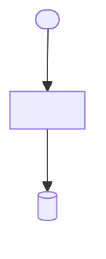

# feat: <feat>

> **Target repo:** <repo path, or "this repo" if the plan lands in-tree>. <Note where app code lives, if it differs from the repo root, or how it changed since the origin brainstorm was written.>
>
> **Plan relationship:** <How this plan relates to its origin brainstorm — e.g. "the scope contract is the brainstorm at `docs/brainstorms/<brainstorm-file>.md`." Note any prior scaffold or plan this supersedes, extends, or resolves deferred decisions from, if applicable.>

## Summary

v0.1 ships a <one-paragraph description of what this plan delivers>.

---

## Problem Frame

<What problem this plan solves, for whom, and why now.> See origin: `docs/brainstorms/<brainstorm-file>.md`.

---

## Requirements

R-IDs in this plan inherit verbatim from the origin brainstorm so traceability is exact. The plan does not introduce new requirements.

- R1–R<n>. <requirement group summary> — see origin.
- R<n+1>–R<m>. <requirement group summary> — see origin.

**Origin actors:** <...>
**Origin flows:** <...>
**Origin acceptance examples:** <...>

---

## Scope Boundaries

- <Scope rejection carried from the origin's Scope Boundaries section, restated unchanged.>
- <...>

### Deferred to Follow-Up Work

- <Item explicitly deferred to a later plan, with a one-line reason it's out of scope here.>

---

## Context & Research

### Relevant Code and Patterns

- <Existing file, module, or prior plan and why it matters to this plan.>

### Institutional Learnings

- <Prior decision, experiment, or lesson learned that constrains or informs this plan.>

### External References

- **<Library, framework, or API name>** — [<doc link label>](<url>). <Which primitive or pattern this plan depends on.>

---

## Key Technical Decisions

<The decisions the origin brainstorm deferred to planning. Each is locked here with rationale.>

1. **<Decision title>.** <Rationale, trade-offs considered, what was rejected and why.> Affects <R-IDs>.
2. **<Decision title>.** <Rationale, trade-offs considered, what was rejected and why.> Affects <R-IDs>.

---

## Open Questions

### Resolved During Planning

- <Item resolved during this planning pass, carried from the origin's "Deferred to Planning" list.>

### Deferred to Implementation

- <Item intentionally left open for implementation to resolve, with a note on when/how it gets answered.>

---

## Output Structure

```
.
├── <path>                                    # <purpose>
├── <path>/
│   └── <path>                                # <purpose>
└── <path>                                    # <purpose>
```

The tree is a scope declaration, not a constraint — adjust during implementation if a better layout emerges. Per-unit `**Files:**` sections remain authoritative for what each unit creates or modifies.

---

## High-Level Technical Design

> *This illustrates the intended approach and is directional guidance for review, not implementation specification.*



Lifecycle:

```
<Flow name>:
  <step> → <step> → <step>
```
