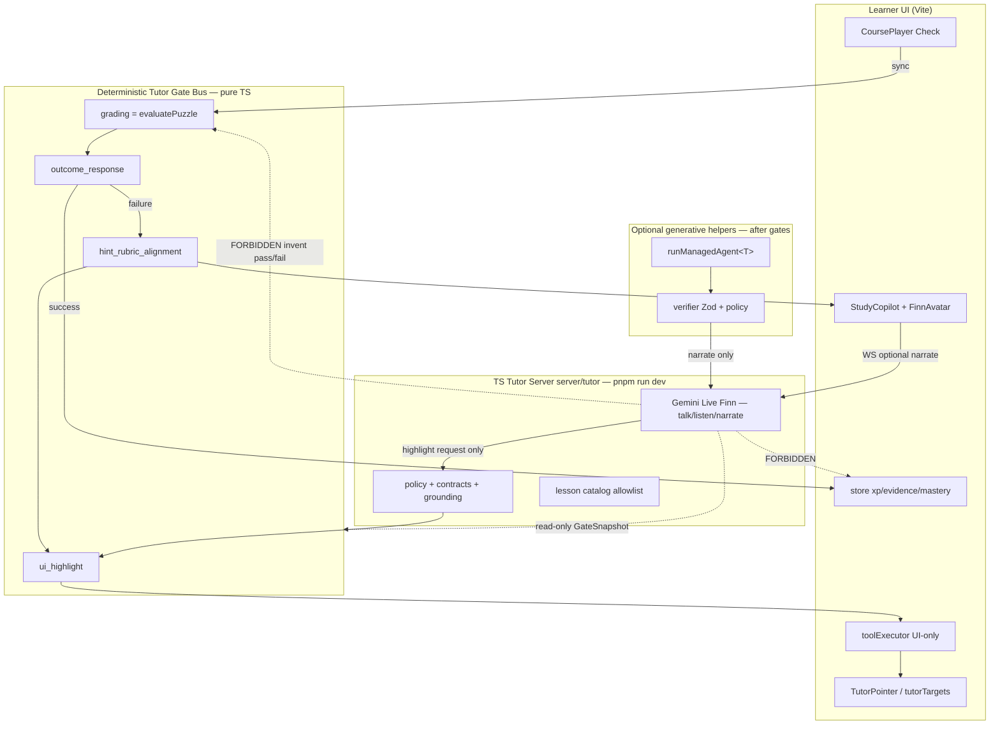

# 2026-07-23-002 — TypeScript agent infra implementation plan

Status: **implemented on branch `cursor/ts-agent-infra-2a84` (2026-07-23)** — Phases 0–4 landed.
Smoke: `pnpm run dev` → Vite `:5173` + tutor `:8080` `/healthz` `degraded` without Gemini keys.

## 1. Recon notes

Verified on filesystem 2026-07-23 (branch `cursor/ts-agent-infra-2a84`):

| Path | Fact |
| --- | --- |
| `tutor-service/` | Live Python FastAPI + Google ADK Gemini Live tutor. `GET /healthz`, `WS /ws/{learner_id}/{session_id}`, `contracts.validate_context`, `policy.safe_spoken_hint`, tools `get_lesson_context` + `render_hint_focus` (allowlisted UI only). |
| `tutor-service/app/catalog.py` | Server-side allowlisted lesson prompts/criteria; context derives trusted language from catalog, not client-supplied prompt. |
| `src/features/copilot/live/useLiveTutor.ts` | Client FSM statuses `idle\|connecting\|ready\|listening\|speaking\|error`; WS protocol `context` / `text` / PCM; reads ADK-shaped events + `live_ready` / `context_ready`. |
| `src/features/copilot/{StudyCopilot,TutorPointer,tutorTargets,toolExecutor,copilotMachine}.*` | StudyCopilot voice WIP is further along than CLAUDE.md admits; tool executor never touches grading; DOM/% pointing via `data-tutor-target`. |
| `src/components/financial/evaluate.ts` + `sim/*` | Sync deterministic Check grading. |
| `src/stores/store.ts` `awardXp` / evidence | Product cores; must stay unreachable from Live tools. |
| `src/agents/finfy-agent/` | Python ADK brokerage `financial_coordinator` + analyst AgentTools — wrong product surface; quarantine in Phase 4. |
| `src/server/`, `src/routes/`, `api/index.ts` | Empty / commented — no app backend. |
| `package.json` `"dev": "vite"` | Does **not** start tutor-service today. |
| `tsconfig.json` | Excludes entire `src/agents` — new TS gates/runtime must be included without pulling Python drafts into `tsc`. |
| Zod / `@google/genai` | Not in package.json yet; Live TS path exists via `@google/genai` `ai.live.connect`. |
| `.env.example` | Missing — must add for tutor env vars. |

**CLAUDE.md discrepancies (record, do not silently rewrite product plans):**

1. CLAUDE.md claims “no backend, no API keys; state is localStorage” — **stale**: `tutor-service/` + `useLiveTutor` are committed live-tutor backend seams.
2. CLAUDE.md treats `src/agents/` as draft-only — **partially true** for `finfy-agent/`, but this plan adds production TS under `src/agents/gates/` + `src/agents/runtime/`.
3. CLAUDE.md “Development commands” omit tutor process — Phase 3 updates only the verified scripts section.

**Architectural decision (locked — do not re-litigate):** four gates are the tutor reaction pipeline (`ui_highlight` → `hint_rubric_alignment` → `grading` → `outcome_response`), code-owned sequencing, not ADK AgentTool orchestration and not a rename of sim/xp/mastery.

## 2. Topology



**Trust boundaries**

- Live root may request allowlisted highlight / pulse / clear only; gate 1 validates before UI.
- Live may narrate inside mode chosen by gate 4; never chooses success vs failure.
- Generative helpers receive gate outputs + lesson snapshot; Zod → verifier → speak; never write store.

## 3. Triage table

| Item | Phase | Priority | Systems rationale | Primary files | Failure mode if skipped |
| --- | --- | --- | --- | --- | --- |
| Gate facades + `GateSnapshot` | 0 | MUST | Shrinks probabilistic surface; unit-testable gates | `src/agents/gates/*` | Model/UI can invent highlight/hint/pass paths without a typed boundary |
| Gate purity + architecture vitest | 0 | MUST | Prevents Live importing awardXp / inventing grade | `src/agents/gates/*.test.ts`, `architecture.test.ts` | Silent regression of §11.2 / gate order |
| Plan file + mermaid | 0 | MUST | DX + topology correctness for later agents | this file | Drift / re-litigation |
| `runManagedAgent` + schemas + verifier | 1 | MUST | Unblocks fake-transport generative seam after outcome | `src/agents/runtime/*` | Phrasing helpers bypass rubric/policy |
| Fake transport tests + feature flag | 1 | MUST | Zero-key CI; default no-op without keys | `runtime/*.test.ts` | Live keys required for CI; accidental prod calls |
| Self-critique pass | 1 | SHOULD | Best-effort safety; must not block Check | `selfCritique.ts` | Slightly weaker spoken safety |
| Prompt `.prompt.md` files | 1 | SHOULD | Prompt/code split like SenseMake | `src/agents/prompts/` | Prompts buried in strings |
| Managed-agent provisioning scripts | 1 | DEFER | Not needed for offline-testable seam | — | N/A |
| TS tutor server (Hono + `ws` + `@google/genai`) | 2 | MUST | Single-package DX; eliminate required Python process | `server/tutor/*` | Dual-runtime forever; Python ADK stays load-bearing |
| Port contracts/policy/catalog/guards | 2 | MUST | Equal/stricter hint-only safety | `server/tutor/{contracts,policy,catalog,grounding}.ts` | Weaker allowlists / answer leak |
| Protocol compat with `useLiveTutor` | 2 | MUST | Prevent StudyCopilot regression | `useLiveTutor.ts` (minimal normalize) | Voice UI breaks |
| Buddy injection prefilter | 2 | SHOULD | Hardens policy against instruction injection | `server/tutor/policy.ts` | Prompt-injection phrasing slips through |
| Structured `trace_id` logs | 2 | SHOULD | Debug without PII | `server/tutor/log.ts` | Opaque live failures |
| Keep Python bridge as long-term runtime | 2 | DEFER (reject) | Pure TS preferred; Python = rollback only | `tutor-service/` | Dual stacks |
| `pnpm run dev` concurrently Vite+tutor | 3 | MUST | Single-command local DX | `package.json`, `vite.config.ts` | Manual two-terminal setup |
| Vite `/tutor-ws` proxy + `.env.example` | 3 | MUST | Simplifies local env; secrets never committed | `.env.example`, vite proxy | Misconfigured WS URL |
| CLAUDE.md scripts touch-up | 3 | MUST | Docs match verified commands | `CLAUDE.md` (scripts only) | Agents follow stale DX |
| `src/agents/README.md` + quarantine drafts | 4 | MUST | Stop wiring brokerage ADK by mistake | `src/agents/README.md`, `_draft_python/` | Future agents ship wrong product |
| TS eval harness ≥20 cases | 4 | SHOULD | Policy/verifier regression net | `src/agents/eval/` | Thin safety net |
| Delete Python tutor-service | 4 | DEFER | Need user approval; keep rollback | `tutor-service/` | Lose rollback path |
| Buddy memory / Pipecat / Postgres | — | DEFER | Out of scope; not required for gates/DX | — | Scope explosion |

**Stack choice (Phase 2):** Node `ws` + lightweight HTTP (`http` or Hono) + `@google/genai` Live. Prefer **Hono** for `/healthz` + CORS clarity with a single `ws` upgrade path, or plain `node:http` + `ws` to minimize deps. **Decision: `ws` + `node:http`** (zero new web framework surface; matches “one small orchestrator dep” budget for Phase 3 `concurrently`). Justify: tutor surface is two endpoints; Hono adds little vs ADK removal win; `@google/genai` is the necessary Live dep.

## 4. Contracts (TypeScript sketches)

```ts
// GateSnapshot — learner-state only; tutor may read, never secrets
type LessonStatus = "idle" | "dirty" | "evaluating" | "success" | "failure";
type GateSnapshot = {
  lessonId: string;
  screenId: string;
  status: LessonStatus;
  criteria: { id: string; label: string; state: "pending" | "pass" | "fail" }[];
  failedCriteria: string[];
  hintLevel: 0 | 1 | 2; // Live ladder; authored H3–H4 stay UI-only
  activeHighlightId: string | null;
  prompt: string; // trusted catalog/UI prompt, never model-authored
};

type OutcomeMode = {
  mode: "success" | "failure" | "coaching";
  failedCriteria: string[];
  speechMode: "celebrate" | "socratic" | "quiet";
};

// Tutor WS (client → server)
type TutorClientMessage =
  | { type: "context"; context: TutorContextPayload }
  | { type: "text"; content: string };
// + binary PCM frames

// Tutor WS (server → client) — dual-read: legacy ADK-shaped + typed control
type TutorServerMessage =
  | { type: "live_ready"; model: string; config?: "ok" | "degraded" }
  | { type: "context_ready"; screen_id: string }
  | { type: "error"; message: string }
  | { type: "tutor_render"; command: { layer: "lesson_tutor"; action: string; criterion_id?: string } }
  | Record<string, unknown>; // legacy Gemini/ADK event dump for audio/transcript

type ManagedAgentTransport = {
  complete(input: { system: string; user: string; jsonSchemaHint?: string }): Promise<string>;
};

type VerifierResult =
  | { ok: true; value: unknown }
  | { ok: false; reason: string; code: "digits" | "criterion" | "outcome_claim" | "xp_claim" | "policy" | "schema" };
```

## 5. Phase 0–4 workstreams

### Phase 0 — Contracts + tutor gate bus

1. Create `src/agents/gates/{types,uiHighlight,hintRubric,grading,outcomeResponse,index}.ts`.
2. Facades wrap `tutorTargets.resolveTutorSelector`, authored hints + policy rules, `evaluatePuzzle`, pure outcome mapping.
3. Vitest: purity (no model imports), outcome never awards XP, highlight validation before setHighlight path helper.
4. Adjust `tsconfig` include/exclude so gates typecheck; keep Python drafts excluded.
5. Acceptance: `pnpm typecheck && pnpm test && pnpm build` green.

### Phase 1 — `runManagedAgent` + verifier

1. `src/agents/runtime/{types,config,schemas,verifier,runner,selfCritique}.ts`.
2. `MissExplainOutput` helper consumed only after failure outcome + rubric pass.
3. Fake transport tests pass/reject; feature flag default off.
4. SHOULD: prompt files + self-critique.
5. Acceptance: fake-transport green; no live keys.

### Phase 2 — Port tutor-service → TypeScript

1. Implement `server/tutor/` with healthz, WS, catalog, contracts, policy, grounding, Live session via `@google/genai`.
2. Degraded `/healthz` when `GEMINI_API_KEY` / `GOOGLE_API_KEY` missing (no crash).
3. Port Python tests to vitest under `server/tutor/*.test.ts` and/or `src/agents`.
4. Minimal `useLiveTutor` normalize for render commands (extend, don’t rewrite).
5. Mark `tutor-service/` deprecated in this plan (delete only with approval).
6. Acceptance: protocol-compatible; policy parity tests green.

### Phase 3 — Single `pnpm run dev`

1. Add `concurrently` (or tiny Node launcher); `"dev"` starts Vite + tutor.
2. Vite proxy `/tutor-ws` → tutor port; `.env.example` documents vars.
3. Without keys: app teaches offline; tutor healthz `degraded`.
4. Minimal CLAUDE.md Development commands update.
5. Acceptance: one command boots both surfaces.

### Phase 4 — Quarantine ADK drafts

1. `src/agents/README.md` path statement.
2. Move `finfy-agent/` → `src/agents/_draft_python/` (ask before delete).
3. SHOULD: `src/agents/eval/` TS cases (≥20 target; document if starting smaller).
4. Acceptance: no app entry import of Python drafts.

## 6. Explicit non-goals

- Port brokerage `financial_coordinator` / ticker / trading analysts into the learner app.
- Let Live mutate XP, streak, achievements, mastery, or puzzle pass/fail.
- Model calls inside `evaluate*` / `sim/*` / `xp` / `bkt` / `projectMastery` / `awardXp`.
- Postgres / Drizzle / Supabase / multi-tenant RLS.
- Buddy memory_layer RAG / full multi-agent mesh.
- Silero/Pipecat unless Gemini Live barge-in proven insufficient **in this app**.
- Rewrite StudyCopilot / TutorPointer; second tutor UI.
- Weaken `safe_spoken_hint` / criterion allowlists / tool guards.
- Payments, social graph, second product domain.
- Rewrite `origin.md` / architecture plans (only this plan + report).
- Brilliant shell chrome retheme (owned elsewhere).

## 7. Test plan

| Layer | What |
| --- | --- |
| Unit gates | uiHighlight allowlist reject; hintRubric digit/question rules; grading facade; outcome modes; purity (no `@google` / `openai` imports; outcome ≠ awardXp) |
| Unit runtime | Fake transport accept/reject; verifier codes; feature flag no-op |
| Unit server | Ported contracts/policy/grounding tests; healthz degraded without keys |
| Architecture | Static import graph / source scan: live handlers must not import `awardXp`/`recordEvidence` |
| Manual voice | Ask Finn → highlight + Socratic question with keys; offline hints without keys |
| DX smoke | `pnpm run dev` → `:5173` lessons + tutor `/healthz` |

## 8. Definition of done

A developer clones the repo, sets optional tutor env vars, runs **`pnpm run dev` once**, and gets the Vite literacy app plus a TS live-tutor server. A learner can fail a Check → **outcome_response** forces failure mode → Finn asks a **hint_rubric**-aligned Socratic question while **ui_highlight** rings the failed criterion; on pass, success mode celebrates and only then may XP/mastery update — while no model call can invent pass/fail, pick an off-allowlist target, or re-sequence the four tutor gates. Fake-transport tests cover generative helpers; ADK brokerage orchestration is quarantined.

## 9. Rollback

If the TS tutor server breaks voice:

1. Stop using `pnpm run dev`’s tutor child (or set `TUTOR_DISABLED=1` if provided).
2. Run legacy Python: `cd tutor-service && uvicorn app.main:app --reload --port 8080` (with its `.venv` + env).
3. Point `VITE_TUTOR_WS_URL=ws://localhost:8080/ws` (bypass Vite proxy).
4. Keep `tutor-service/` in tree until explicit delete approval.

---

*Python `tutor-service/` status after Phase 2: **deprecated** as required runtime; retained for rollback until Phase 4 user approval to delete.*
