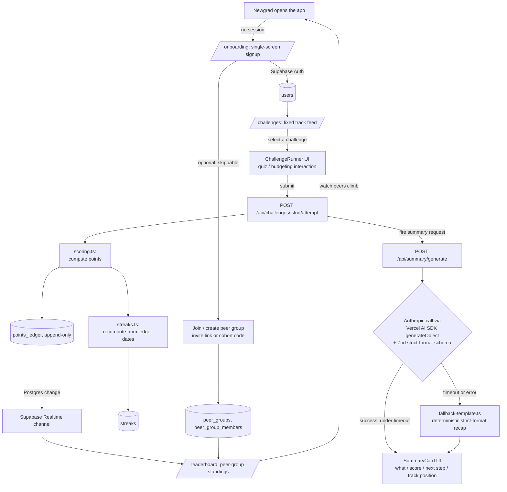

# feat: finfy-literacy — gamified financial literacy MVP

> **Target repo:** this repo, `innopoly-financial-literacy`. No finfy-literacy application code exists yet — the repository history is a single initial commit that adds the `docs/` tree. This plan describes a fresh build, not a migration.
>
> **Plan relationship:** `docs/plans/finfy-literacy-architecture-plan.md` is intended to be this plan's scope contract, the same way an upstream architecture/brainstorm doc constrains a downstream implementation plan. At the time this plan was written, that document had not yet been rewritten for finfy-literacy and still carried unrelated content from a prior product. This plan is therefore grounded directly in `docs/plans/origin.md` (the product-judgment source of truth) and in `docs/plans/finfy-literacy-phase-0-planning.md` plus `docs/plans/features/*.md` (KPIs, user journey, and per-feature rationale). Once the architecture plan is rewritten for finfy-literacy, it becomes authoritative over this plan wherever the two disagree; until then, `origin.md` and the Phase 0/1 docs win.

## Summary

finfy-literacy's MVP is a mobile-first web app built around one loop: a newgrad picks a short, duolingo-style financial literacy challenge (budgeting, saving, investing, or credit management), completes it in a few minutes, earns points that move them on a leaderboard shared with a **real peer group** — friends, a signup cohort, or coworkers, never anonymous strangers — and immediately receives an AI-generated recap in a **strict, fixed format**: what they did, their score, one specific next step, and their track position. The three pieces of that loop have different constraints and are built as three decoupled surfaces around one shared Postgres store: challenge-taking wants to feel instant and forgiving, the leaderboard wants to feel socially live, and the AI summary wants to feel personal but must never block or blank the core loop if the LLM call is slow or fails.

The product's core commitment, carried directly from `origin.md`:

> Newgrads complete financial literacy challenges, compete in leaderboards within a real peer group, and AI summarizes with a strict format.

This is deliberately **not** a financial planning tool, a bank-integrated budgeting app, or a social platform. The MVP has one educational content surface (four fixed modules), one social surface (a real-peer leaderboard, no badges or achievements beyond points and streaks), and one AI surface (a schema-validated recap, not a chat). Everything else named in `origin.md`'s scope boundary — financial advice, institution integrations, advanced analytics, messaging/forums, monetization — is explicitly out. The MVP-ready demo: a newgrad signs up in one screen, lands directly on their first challenge, completes it, watches their points post to a leaderboard shared with two seeded peers, and reads a four-line AI recap that took under three seconds to render. *"This is not a budgeting app. It is a habit loop for financial literacy, and the leaderboard is why they come back tomorrow."*

---

## Problem Frame

A newgrad who just received their first paycheck is at the single most motivated moment they will ever be for learning financial literacy, and today that motivation has nowhere good to land. Existing resources — bank blog posts, personal-finance courses, generic budgeting apps — are dry, generic, and built for someone who already has the discipline to seek them out and finish them. Nothing pulls the newgrad *back* the next day. finfy-literacy's answer is to borrow the mechanics that already solve "coming back tomorrow" for language learning — short sessions, points, streaks, and a leaderboard against people you actually know — and apply them to financial literacy content instead of vocabulary drills, with an AI layer that turns a raw score into a specific, readable takeaway every single time.

That reframing forces an architectural split. Challenge-taking is a synchronous, latency-sensitive UI loop: a newgrad opens a challenge expecting an instant, forgiving interaction, and any lag between "submit" and "see my points" breaks the game feel that makes the format work at all. The leaderboard is a social, near-real-time surface: its entire value is that a peer's progress shows up *while the newgrad is still in the app*, not on next login. The AI summary is a generative, occasionally-slow, occasionally-fallible step bolted onto the end of the same interaction — and because it is the emotional payoff Phase 0 identifies as the thing that "turns raw performance into a specific, actionable takeaway," it cannot be allowed to hold the rest of the loop hostage to an LLM provider's latency or uptime. Treating these three surfaces as one monolithic request/response cycle would mean a slow or failed AI call degrades challenge-taking and leaderboard freshness along with it; this plan instead treats scoring, leaderboard recomputation, and summary generation as three steps that can each succeed, degrade, or fail independently, with the summary step alone carrying an explicit non-LLM fallback so the core loop never breaks.

---

## Requirements

R-IDs are sequential across groups. Each requirement traces to an explicit statement in `docs/plans/origin.md`, `docs/plans/finfy-literacy-phase-0-planning.md`, or the relevant `docs/plans/features/*.md` doc.

**Challenge content and the gamified core loop**

- R1. **Four-module challenge content model.** Every challenge belongs to exactly one of four modules — budgeting, saving, investing, credit management — and to a position in a single MVP track (see R3).
- R2. **Short, checkable challenges.** Each challenge completes in a few minutes and ends in a concrete, checkable action (a scored quiz answer, a budget-allocation exercise, a scenario decision) rather than passive reading.
- R3. **Fixed linear track for MVP.** All users see the same ordered sequence of challenges across the four modules; adaptive difficulty and personalized tracks are explicitly deferred (see Scope Boundaries).
- R4. **Points on completion.** Completing a challenge awards points based on the correctness/quality of the submitted answer, not time spent; the points value is part of the challenge's content definition.
- R5. **No real financial data ingestion.** Challenges use hypothetical or sample financial scenarios only; the MVP never requests or stores a user's actual payslip, bank balance, or transaction history, matching origin.md's "no institution integrations" exclusion.

**Points, streaks, and leaderboard data**

- R6. **Append-only points ledger.** Every scored challenge attempt writes one row to an append-only ledger; a user's total points is a derived sum, never a directly mutated counter.
- R7. **Streak defined by ledger dates.** A streak increments for each distinct calendar day (in the user's local timezone) with at least one completed attempt, and breaks on the first fully-missed day; streak state is recomputed from the ledger, not stored as an independent counter that can drift.
- R8. **Leaderboard scoped to a real peer group.** Rankings are always computed within a peer group the user actually belongs to (invited friends, a cohort/company code, or coworkers) — never an anonymous global ranking, per origin.md's explicit product judgment.
- R9. **Solo state, not an empty/error state.** A user with no peer group yet still sees a personal progress view (their own points and streak) rather than a blank leaderboard or an error screen.
- R10. **Near-live leaderboard updates.** A completed challenge is reflected in peers' leaderboard views without requiring a manual page refresh.
- R11. **Cumulative ranking for MVP.** The MVP leaderboard accumulates points indefinitely; periodic reset cadence is an explicit follow-up A/B test, not an MVP decision.

**AI-generated strict-format summary**

- R12. **One summary per completed challenge.** Every scored challenge attempt triggers exactly one AI-generated summary request.
- R13. **Fixed four-field schema.** The summary output is validated against a single fixed schema — what the user did, their score, one specific next step, their track position — with no additional freeform fields and no per-call format variation.
- R14. **Low-latency delivery.** The summary is presented to the user immediately after challenge completion, in the same session, not as a delayed notification or async batch job.
- R15. **Deterministic fallback on failure.** If the LLM call errors or exceeds a fixed timeout, a non-LLM fallback template produces the same four fields from the raw score data; the recap surface never shows an indefinite spinner or a blank/error state in place of the required fields.
- R16. **Specific, not generic, next step.** The "next step" field must reference the user's actual weak area from the just-completed attempt; a generic "keep up the good work" is schema-valid only for a genuinely perfect attempt (see Open Questions).
- R17. **No individualized financial advice.** The summary never issues personalized financial advice or product recommendations ("invest in X," "open account Y"); it stays scoped to performance on educational content, matching the MVP's explicit "no financial planning tools/advice" exclusion.

**Onboarding and account management**

- R18. **Single-screen signup.** Account creation is one screen (email or social OAuth) with no mandatory profile questionnaire gating the first challenge.
- R19. **Direct-to-first-challenge.** Onboarding ends by placing the user directly into their first challenge, not an intermediate tutorial or lesson screen.
- R20. **Skippable peer-group join.** Joining or creating a peer group (invite link or cohort code) is offered during onboarding but is skippable and completable later from account settings.
- R21. **Minimum viable account management.** Authenticated users have access to a profile, basic settings, a history of completed challenges, and the ability to export or delete their data, given the product handles financial-adjacent personal information.

**Mobile-first platform and technical foundation**

- R22. **Mobile-first responsive web.** The MVP ships as a responsive web app designed first for a phone-sized viewport — not a native app, and not a desktop-first layout adapted down.
- R23. **Core loop fits one mobile session.** Pick a challenge → complete it → see the AI summary → check the leaderboard completes within a single mobile session without a full-page reload breaking the flow.
- R24. **No desktop-only interactions gate the core loop.** Every action required to complete the core loop is reachable by touch/tap; hover-only affordances are never load-bearing.

---

## Scope Boundaries

**In scope for the hackathon MVP:**

- Four-module fixed-track gamified challenges (budgeting, saving, investing, credit management) with points on completion (R1–R5)
- Points ledger, streak computation, and a real-peer-group leaderboard with near-live updates (R6–R11)
- One AI-generated, schema-validated, strict-format summary per completed challenge, with a deterministic fallback (R12–R17)
- Single-screen onboarding directly into the first challenge, with a skippable peer-group join step (R18–R20)
- Minimum viable account management: profile, settings, progress history, export/delete (R21)
- Mobile-first responsive web app covering the full core loop (R22–R24)
- Demo readiness: seeded challenge content across all four modules, a seeded demo peer group, and a judge-readable landing page / README

**Out of scope for the MVP** (explicit exclusions carried from `origin.md`):

- Financial planning tools or personalized financial advice beyond the fixed educational content
- Integration with banks or other financial institutions — no real transaction or balance data
- Advanced analytics or reporting dashboards, for users or admins
- Social features beyond the leaderboard — no messaging, comments, or forums
- Monetization or premium tiers
- Localization or translation beyond English
- Gamification mechanics beyond points, streaks, and leaderboards — no badges, achievements, or reward shops
- Native iOS/Android apps
- Push notifications

### Deferred to Follow-Up Work

- Personalized/adaptive challenge tracks (Phase 0 "Custom courses" tracking; `gamified-challenges.md` Personalization A/B stage)
- Adaptive difficulty within a track (`gamified-challenges.md`)
- Content scale-out via hand-authored plus reviewed AI-generated challenges (`gamified-challenges.md`)
- Leaderboard reset-cadence A/B — weekly reset vs. cumulative (`leaderboards-peer-competition.md`)
- Cohort/company-code join flow as an alternative to friend invites (`leaderboards-peer-competition.md`)
- Leaderboard privacy opt-out control (`leaderboards-peer-competition.md` open question)
- No-summary control A/B and next-step framing A/B — peer-relative vs. self-relative phrasing (`ai-generated-summaries.md`)
- Extended summary schema fields, e.g. a streak-risk warning (`ai-generated-summaries.md` "Format schema v2")
- Personalization step in onboarding — a job/industry question before the first challenge (`onboarding-account-management.md`)
- Push-notification streak-risk reminders (`mobile-first-design.md`)
- Native app evaluation once the responsive web MVP validates the loop (`mobile-first-design.md`)
- Deeper elective modules (investing fundamentals, credit-building, tax optimization) and a bridge to real financial products or services (Phase 0 "Advanced financial learning" tracking)
- High-school financial literacy variant (`origin.md` secondary future use case)
- "AI video call" mascot feature (`origin.md` secondary future use case)
- Multi-tenant hardening beyond application-level scoping — e.g. Postgres Row Level Security policies — once user/group volume justifies it

---

## Context & Research

### Relevant Code and Patterns

- No existing finfy-literacy application code exists in this repository yet — the git history is a single initial commit adding the `docs/` tree. This plan describes a fresh build, not a migration or refactor.
- Local mockup reference images at `docs/audit/fingo-references-png/` (`fingo-001.png` through `fingo-006.png`) are the closest available visual precedent for a mobile-first, gamified financial app. Treat them as visual/interaction reference during implementation, not as literal reproduction targets.
- `docs/plans/finfy-literacy-architecture-plan.md` exists in the repository but, as of this plan's authoring, has not yet been rewritten for finfy-literacy and still carries content from an unrelated prior product. Do not treat its current contents as load-bearing for finfy-literacy; re-derive from `origin.md` and the Phase 0/1 docs instead, and defer to that document once it is rewritten.

### Institutional Learnings

- Phase 0 planning names "cohort completion parity" — the variance in completion rate within a peer leaderboard group — as the test of whether peer visibility is actually pulling people along versus just decorating the screen. The leaderboard backend should make group-scoped completion rate computable, not just render a ranked point total.
- `leaderboards-peer-competition.md` flags that financial-progress-as-a-proxy-for-financial-standing is a real privacy sensitivity distinct from ordinary gamification leaderboards. Even though the MVP ranks by learning-activity points rather than net worth, leaderboard and summary copy should avoid language that reads as a wealth signal.
- `ai-generated-summaries.md` treats the strict format as a product commitment, not an implementation shortcut: the same reasoning that makes a duolingo-style recap screen legible on first read requires holding the schema fixed even when a richer free-form LLM response is available. This directly informs the schema-validated approach in Key Technical Decisions below.
- `onboarding-account-management.md` and `mobile-first-design.md` converge on the same underlying constraint: the newgrad's motivation window right after a first paycheck is narrow, so both onboarding friction and mobile session-length budgets are first-class product risks, not just UX nice-to-haves.
- `gamified-challenges.md` explicitly leaves challenge length as an open, testable question (30 seconds vs. 2 minutes vs. 5 minutes) rather than assuming an answer. The challenge content model (R1) makes challenge length a per-challenge content property, not a schema constraint, so this can be tuned later without a migration.

### External References

- **Next.js 15 App Router** — [docs](https://nextjs.org/docs/app), [Route Handlers](https://nextjs.org/docs/app/building-your-application/routing/route-handlers), [Server Actions](https://nextjs.org/docs/app/building-your-application/data-fetching/server-actions-and-mutations).
- **Supabase** — [docs](https://supabase.com/docs), [Auth](https://supabase.com/docs/guides/auth), [Realtime (Postgres Changes)](https://supabase.com/docs/guides/realtime/postgres-changes), [Row Level Security](https://supabase.com/docs/guides/database/postgres/row-level-security).
- **Drizzle ORM** — [docs](https://orm.drizzle.team/docs/overview), [Drizzle Kit migrations](https://orm.drizzle.team/docs/kit-overview).
- **Vercel AI SDK** — [docs](https://sdk.vercel.ai/docs), `generateObject` for schema-validated structured output.
- **Anthropic API** — [docs](https://docs.anthropic.com/), model selection guidance for latency/cost-sensitive short-form generation.
- **Zod** — [docs](https://zod.dev) — source of truth for the summary schema and shared content/domain types.
- **shadcn/ui** — [components](https://ui.shadcn.com/docs/components), card/button/tabs primitives for the challenge, summary, and leaderboard cards.
- **Tailwind CSS** — [v4 docs](https://tailwindcss.com/docs), mobile-first breakpoint conventions.
- **Vitest** — [docs](https://vitest.dev) — unit and integration test runner.
- **Consumer Financial Protection Bureau — consumer education resources** — [consumerfinance.gov](https://www.consumerfinance.gov/consumer-tools/) — general reference for budgeting/credit/saving content accuracy, not a data integration.
- **National Financial Educators Council** — [nfec.org](https://www.nfec.org/) — general reference for financial literacy curriculum scope (budgeting, saving, investing, credit) used to sanity-check the four-module split.

---

## Key Technical Decisions

1. **Mobile-first responsive web app, not native.** Next.js 15 (App Router) + React 19 + TypeScript, styled Tailwind-first with shadcn/ui primitives. Rationale: fastest path to a testable core loop across iOS and Android without app-store friction; `mobile-first-design.md` explicitly stages a native build as a later evaluation gate, not an MVP requirement.
2. **Managed Postgres (Supabase) over a single-file database.** Rationale: the leaderboard needs real multi-user, multi-peer-group data from day one — not a single demo user — so relational joins across users, attempts, points, and groups are core to the product, not an afterthought. Supabase bundles managed Postgres, Auth, and Realtime in one hosted service, keeping ops surface low while staying production-shaped.
3. **Drizzle ORM as the typed query layer.** Rationale: lightweight, SQL-shaped, fast cold start, first-class TypeScript inference — a good fit for a small, points/streaks/leaderboard-shaped schema that doesn't need a heavier ORM's abstraction.
4. **Supabase Auth (email + OAuth) for onboarding, not a custom auth system.** Rationale: matches the single-screen signup requirement (R18) without building session/password infrastructure from scratch, and keeps a clean line between anonymous demo access and account-linked progress.
5. **Supabase Realtime (Postgres Changes) to push leaderboard updates.** Rationale: the product's emotional hook is watching peers climb the leaderboard (Phase 0 user journey, step 4); near-live updates make peer movement visible during the same session instead of on next login, without hand-rolling a WebSocket layer.
6. **Single schema-validated LLM call for the summary, not a multi-step agent.** The summarizer uses the Vercel AI SDK's `generateObject` against a fixed Zod schema, backed by a single Anthropic model call. Rationale: the core loop needs exactly one strict-format recap per challenge (R12, R13), not an autonomous multi-step reasoning process; a single schema-validated call minimizes latency, cost, and failure surface, and the Zod schema is the single source of truth for "strict format."
7. **Deterministic non-LLM fallback template for the summary.** Rationale: the recap card is the emotional payoff of every single challenge completion (R14); an LLM timeout or outage must never block or blank the core loop, so a template-based fallback computes the same four fields directly from the raw score and challenge metadata.
8. **Fast, cost-efficient model tier for the summarizer.** The summary call targets Anthropic's smallest/fastest current model tier (a Haiku-class model, exact snapshot pinned at implementation time) rather than a larger reasoning model. Rationale: the task is short, structured, and low-latency-sensitive (R14); a larger model would add cost and latency without improving a four-field, schema-constrained output.
9. **Challenge content as versioned seed data, not a CMS.** Rationale: the MVP ships one fixed, hand-authored track (R3); a CMS is unwarranted complexity before content-authoring scale is proven necessary — `gamified-challenges.md`'s phase-tracking stages hybrid/AI-generated content as a later stage, not an MVP requirement.
10. **Points ledger as an append-only table, not a mutable running total column.** Rationale: supports recompute, auditability, and safe retries if a challenge-completion request is retried or a downstream summary call fails mid-flight; leaderboard totals are a derived `SUM`, never a directly written source of truth (R6).
11. **Streak computed from ledger dates, not a separately maintained counter.** Rationale: the same auditability argument as points — recomputing from `challenge_attempts` timestamps avoids a second source of truth that can silently desync from actual completions (R7).
12. **Peer groups modeled as their own many-to-many join table, not a single `team_id` column on users.** Rationale: a user may plausibly belong to more than one peer context (a friend group and a coworker cohort); origin.md explicitly frames peer groups as "friends/cohort/coworkers," which is a many-to-many relationship, not a single membership.
13. **No badges/achievements system; points plus streaks plus leaderboard is the entire gamification surface.** Rationale: explicit MVP exclusion in origin.md — "it will not include complex gamification mechanics such as badges, achievements, or rewards in the MVP." Keeps the schema and UI surface small for a hackathon-scoped build.
14. **Two managed services (Vercel + Supabase), no bespoke server to operate.** Rationale: both have generous free/hackathon tiers, both are globally available, and the split keeps the "backend" honestly thin — a Postgres database plus one summarizer endpoint — rather than a custom server the team has to keep alive through judging.

---

## Open Questions

### Resolved During Planning

- *Native app vs. responsive web for MVP?* — responsive web, mobile-first (R22; `mobile-first-design.md`).
- *Personalized vs. fixed challenge track for MVP?* — fixed linear track; personalization is an explicit follow-up A/B (R3; `gamified-challenges.md` Custom Courses phase).
- *Leaderboard scope: real peers or anonymous global ranking?* — real peer group only, never anonymous global (R8; origin.md explicit product judgment).
- *Badges/achievements in the MVP?* — excluded; points, streaks, and leaderboard are the entire gamification surface (origin.md explicit exclusion).
- *Bank/institution integration in the MVP?* — excluded; challenges use hypothetical scenarios only (R5; origin.md explicit exclusion).
- *Leaderboard update model?* — near-live via Supabase Realtime, not poll-only or next-login-only (R10).

### Deferred to Implementation

- Exact field names, ordering, and length caps for the four-field summary schema beyond "what they did / score / next step / track position" (`ai-generated-summaries.md` open question).
- Whether the summary references leaderboard standing directly, or stays scoped to the user's own performance to avoid discouraging framing (`ai-generated-summaries.md` open question).
- Exact fallback behavior when the model can't produce a confident, specific "next step" — e.g. a perfect-score attempt — a generic congratulatory framing vs. a different-next-challenge suggestion (R16; `ai-generated-summaries.md` open question).
- What precisely defines a "real peer group" at signup — invited friends only, a cohort/company code, or an opt-in matching flow — and the exact empty-state design for a user with no peers yet beyond the minimum solo view required by R9 (`leaderboards-peer-competition.md` open question).
- Whether the leaderboard needs an explicit privacy opt-out control, given the sensitivity of financial-progress-as-a-proxy-for-standing (`leaderboards-peer-competition.md` open question).
- Exact leaderboard reset cadence policy design (cumulative confirmed for MVP; weekly-reset variant is a deferred A/B, not a resolved decision) (`leaderboards-peer-competition.md`).
- Minimum viable signup field set — bare email/social only, or one lightweight job/industry question before the first challenge (`onboarding-account-management.md` open question).
- Whether push-notification streak-risk nudges belong in a near-term follow-up or a later phase (`mobile-first-design.md` open question).
- Where new challenge content comes from at scale once the fixed hand-authored track is exhausted — hand-authored only, AI-generated and reviewed, or a hybrid — and the content review bar before anything ships (`gamified-challenges.md` open question).
- The right challenge length to maximize completion without feeling trivial — 30 seconds vs. 2 minutes vs. 5 minutes (`gamified-challenges.md` open question).

---

## Output Structure

Implementation file layout for the MVP. The app lives at the repository root alongside `docs/`.

```
.
├── package.json
├── tsconfig.json
├── next.config.ts
├── tailwind.config.ts
├── postcss.config.mjs
├── drizzle.config.ts
├── biome.json
├── vitest.config.ts
├── .env.example                          # SUPABASE_URL, SUPABASE_ANON_KEY, SUPABASE_SERVICE_ROLE_KEY,
│                                          # DATABASE_URL, ANTHROPIC_API_KEY
├── .gitignore
├── README.md
├── docs/
│   └── plans/ ...                        # existing planning docs (this file's home)
├── src/
│   ├── app/
│   │   ├── layout.tsx
│   │   ├── page.tsx                      # landing + "start your first challenge" CTA
│   │   ├── globals.css
│   │   ├── onboarding/
│   │   │   └── page.tsx                  # single-screen signup + optional peer-group join (R18–R20)
│   │   ├── challenges/
│   │   │   ├── page.tsx                  # challenge feed / track view
│   │   │   └── [slug]/
│   │   │       └── page.tsx              # challenge runner (quiz / budgeting interaction)
│   │   ├── leaderboard/
│   │   │   └── page.tsx                  # peer-group leaderboard view
│   │   ├── account/
│   │   │   └── page.tsx                  # profile, settings, progress history, export/delete (R21)
│   │   ├── auth/
│   │   │   └── callback/
│   │   │       └── route.ts              # Supabase Auth OAuth / magic-link callback
│   │   └── api/
│   │       ├── challenges/
│   │       │   └── [slug]/
│   │       │       └── attempt/
│   │       │           └── route.ts      # POST: score attempt, write points ledger, recompute streak
│   │       ├── summary/
│   │       │   └── generate/
│   │       │       └── route.ts          # POST: strict-format AI summary (schema-validated + fallback)
│   │       ├── leaderboard/
│   │       │   └── [groupId]/
│   │       │       └── route.ts          # GET: ranked peer-group standings
│   │       └── peer-groups/
│   │           ├── route.ts              # POST: create/join a peer group
│   │           └── invite/
│   │               └── route.ts          # POST: generate an invite / cohort code
│   ├── components/
│   │   ├── ChallengeCard.tsx
│   │   ├── ChallengeRunner.tsx           # quiz / budgeting-slider interaction shell
│   │   ├── PointsBadge.tsx
│   │   ├── StreakFlame.tsx
│   │   ├── LeaderboardList.tsx
│   │   ├── LeaderboardRow.tsx
│   │   ├── SoloProgressCard.tsx          # solo state when no peer group exists (R9)
│   │   ├── SummaryCard.tsx               # strict-format recap: what / score / next step / track position
│   │   ├── OnboardingForm.tsx
│   │   ├── PeerGroupInvite.tsx
│   │   └── MobileNav.tsx
│   ├── content/
│   │   ├── tracks.ts                     # track sequencing across budgeting → saving → investing → credit
│   │   ├── budgeting/
│   │   │   └── *.json                    # per-challenge seed content
│   │   ├── saving/
│   │   │   └── *.json
│   │   ├── investing/
│   │   │   └── *.json
│   │   └── credit/
│   │       └── *.json
│   ├── db/
│   │   ├── client.ts                     # Drizzle + Supabase Postgres connection
│   │   ├── schema.ts                     # users, challenges, attempts, points_ledger, streaks,
│   │   │                                 # peer_groups, peer_group_members
│   │   ├── queries.ts                    # typed read/write helpers (scoped by user_id / group_id)
│   │   ├── migrations/
│   │   └── seed.ts                       # seeds challenge content + a demo peer group
│   ├── llm/
│   │   ├── client.ts                     # Vercel AI SDK + Anthropic provider factory
│   │   ├── summary-schema.ts             # Zod schema: {what_you_did, score, next_step, track_position}
│   │   ├── summarize.ts                  # generateObject call + bounded retry + timeout
│   │   └── fallback-template.ts          # deterministic non-LLM strict-format fallback
│   ├── lib/
│   │   ├── supabase-server.ts            # server-side Supabase client (auth + Realtime)
│   │   ├── supabase-browser.ts           # browser Supabase client
│   │   ├── scoring.ts                    # challenge submission → points calculation
│   │   ├── streaks.ts                    # streak recompute from ledger dates
│   │   ├── tenancy.ts                    # withUser(userId, query) / withGroup(groupId, query) scoping
│   │   └── safety.ts                     # blocks financial-advice / institution-integration language
│   └── types.ts                          # shared Zod schemas: Challenge, Attempt, Summary, LeaderboardRow
├── test/
│   ├── db.test.ts
│   ├── tenancy.test.ts
│   ├── scoring.test.ts
│   ├── streaks.test.ts
│   ├── leaderboard.test.ts
│   ├── summary/
│   │   ├── summarize.test.ts
│   │   └── fallback-template.test.ts
│   ├── safety.test.ts
│   ├── e2e.test.ts                       # full onboarding → challenge → summary → leaderboard flow
│   └── fixtures/
│       ├── demo-user.json
│       ├── demo-peer-group.json
│       └── challenge-attempts/
└── public/
    └── (icons, mascot art if any — see docs/audit/fingo-references-png/ for visual reference)
```

---

## High-Level Technical Design

> *This illustrates the intended approach and is directional guidance for review, not implementation specification. The implementing agent should treat it as context, not code to reproduce.*



State across the pipeline:

```
Challenge attempt lifecycle:
  started (challenge opened) → answering → submitted →
    scored (points computed, points_ledger row written, streak recomputed) →
      summary_requested → summary_ready | summary_fallback → displayed

Leaderboard lifecycle:
  stale → recompute_triggered (on points_ledger write) →
    realtime_broadcast (Supabase Realtime) → synced (peer clients update without a manual refresh)

Streak lifecycle:
  active → (an attempt is scored today) → extended
  active → (a full day passes with zero scored attempts) → broken → active (next scored attempt starts a new streak)
```

---

## Implementation Units

### Phase 1 — Scaffold

- U1. **Next.js scaffold + Tailwind + shadcn/ui + Drizzle + Supabase client + Vitest install**

  **Goal:** Land an empty Next.js 15 app at the repo root that builds, lints, and runs, with Drizzle, the Supabase clients, and the Vercel AI SDK ready to import.

  **Requirements:** Structural prerequisite for all units.

  **Dependencies:** None.

  **Files:**
  - Create: `package.json` (deps include `next@^15`, `react@^19`, `tailwindcss@^4`, `drizzle-orm`, `@supabase/supabase-js@^2`, `@supabase/ssr`, `ai@^5`, `@ai-sdk/anthropic`, `zod@^4`; devDeps: `typescript@^5.9`, `vitest@^3.2`, `@biomejs/biome@^2`, `drizzle-kit`, `@types/node`, `@types/react`)
  - Create: `next.config.ts`, `tsconfig.json`, `tailwind.config.ts`, `postcss.config.mjs`, `biome.json`, `vitest.config.ts`, `drizzle.config.ts`, `.gitignore`, `.env.example`
  - Create: `src/app/layout.tsx`, `globals.css`, `page.tsx` (landing page with a one-sentence hero and a "start your first challenge" CTA)
  - Create: `README.md` (setup + demo run + judge-readable one-pager)
  - Initialize: `npx create-next-app . --ts --tailwind --app`; add the dependencies above; `npx shadcn init` for component primitives.

  **Verification:**
  - `npm run dev` serves the landing page; `npm run build` succeeds; `npm run check` (Biome + `tsc --noEmit`) exits 0.

- U2. **Core-loop UI shell with mock data**

  **Goal:** A reviewer can navigate the full MVP flow without any backend wired up: landing → onboarding → challenge feed → challenge runner → mock summary card → mock leaderboard.

  **Requirements:** R1, R8, R13, R22 (visible full-loop surface; not yet backed by real data).

  **Dependencies:** U1.

  **Files:**
  - Create: `src/app/onboarding/page.tsx`, `src/components/OnboardingForm.tsx`
  - Create: `src/app/challenges/page.tsx`, `src/components/ChallengeCard.tsx`
  - Create: `src/app/challenges/[slug]/page.tsx`, `src/components/ChallengeRunner.tsx`
  - Create: `src/components/SummaryCard.tsx`, `src/components/LeaderboardList.tsx`, `src/components/LeaderboardRow.tsx`, `src/components/SoloProgressCard.tsx`
  - Create: `test/fixtures/demo-user.json`, `test/fixtures/demo-peer-group.json`, and a mock-outputs fixture matching the strict-format schema

  **Verification:**
  - A reviewer unfamiliar with the product completes the full mock flow (signup → challenge → summary → leaderboard) on a phone-sized viewport in under a minute without explanation.

### Phase 2 — Content and persistence foundation

- U3. **Challenge content model + seed data**

  **Goal:** Structured, versioned challenge content exists for all four modules, sequenced into a single fixed MVP track.

  **Requirements:** R1, R2, R3, R4.

  **Dependencies:** U1.

  **Files:**
  - Create: `src/content/tracks.ts` (ordered module → challenge sequence)
  - Create: `src/content/budgeting/*.json`, `saving/*.json`, `investing/*.json`, `credit/*.json` (at least 3–4 challenges per module)
  - Create: `src/types.ts` (Zod `ChallengeSchema`: `slug`, `module`, `order`, `prompt`, `answer_shape`, `points_value`, `estimated_seconds`)
  - Test: `test/content.test.ts`

  **Approach:**
  - Each challenge JSON validates against `ChallengeSchema`; `estimated_seconds` is stored per-challenge so challenge-length tuning (an open question) never requires a schema migration.
  - `tracks.ts` is the single source of ordering truth; the challenge feed and challenge runner both read from it rather than sorting challenges independently.

  **Test scenarios:**
  - Every seed challenge file validates against `ChallengeSchema`.
  - `tracks.ts` produces a strictly ordered sequence with no gaps or duplicate positions.

  **Verification:**
  - All scenarios pass.

- U4. **Postgres schema (Drizzle) + tenancy helpers + user/challenge/points/streak tables**

  **Goal:** A Supabase Postgres schema exists for users, challenges, attempts, the points ledger, and streaks, with every query scoped by `user_id` through a typed wrapper.

  **Requirements:** R6, R7, R21.

  **Dependencies:** U1, U3.

  **Files:**
  - Create: `src/db/client.ts` (Drizzle + Supabase Postgres connection)
  - Create: `src/db/schema.ts`
  - Create: `src/db/queries.ts`
  - Create: `src/lib/tenancy.ts` (`withUser(userId, query)` typed wrapper)
  - Create: `src/db/seed.ts` (seeds `src/content` challenges into the DB)
  - Test: `test/db.test.ts`, `test/tenancy.test.ts`

  **Approach:**
  - **Schema:**
    - `users(id UUID PK, created_at TIMESTAMPTZ, display_name TEXT, timezone TEXT NOT NULL DEFAULT 'UTC')`
    - `challenges(id INTEGER PK, slug TEXT UNIQUE NOT NULL, module TEXT NOT NULL, track_order INTEGER NOT NULL, points_value INTEGER NOT NULL)`
    - `challenge_attempts(id BIGINT PK, user_id UUID FK NOT NULL, challenge_id INTEGER FK NOT NULL, submitted_answer_json JSONB NOT NULL, is_correct BOOLEAN NOT NULL, weak_area TEXT, created_at TIMESTAMPTZ NOT NULL)`
    - `points_ledger(id BIGINT PK, user_id UUID FK NOT NULL, attempt_id BIGINT FK NOT NULL UNIQUE, points INTEGER NOT NULL, created_at TIMESTAMPTZ NOT NULL)` — `UNIQUE(attempt_id)` enforces the idempotency guarantee behind R6.
    - `streaks(user_id UUID PK FK, current_streak_days INTEGER NOT NULL DEFAULT 0, longest_streak_days INTEGER NOT NULL DEFAULT 0, last_active_date DATE)`
    - Indexes on `challenge_attempts(user_id, created_at)`, `points_ledger(user_id, created_at)`.
  - **Tenancy enforcement:** `withUser(userId, q)` wraps every read/write so a forgotten `WHERE user_id = …` clause is impossible. A test scans `queries.ts` for unscoped SQL.

  **Test scenarios:**
  - Inserting an attempt + ledger row round-trips through `queries.ts`.
  - `withUser('other-user', …)` against seed data returns 0 rows for a different user's data.
  - Re-running `seed.ts` is idempotent (no duplicate challenge rows).

  **Verification:**
  - All scenarios pass.

- U5. **Peer group schema + membership + invite mechanism**

  **Goal:** Users can belong to one or more peer groups; groups are joinable via an invite code.

  **Requirements:** R8, R9, R20.

  **Dependencies:** U4.

  **Files:**
  - Modify: `src/db/schema.ts` (add `peer_groups`, `peer_group_members`)
  - Create: `src/lib/tenancy.ts` — extend with `withGroup(groupId, query)`
  - Create: `src/app/api/peer-groups/route.ts`, `src/app/api/peer-groups/invite/route.ts`
  - Test: `test/peer-groups.test.ts`

  **Approach:**
  - `peer_groups(id UUID PK, name TEXT, invite_code TEXT UNIQUE NOT NULL, created_by UUID FK, created_at TIMESTAMPTZ)`
  - `peer_group_members(group_id UUID FK, user_id UUID FK, joined_at TIMESTAMPTZ, PRIMARY KEY(group_id, user_id))` — many-to-many, per Key Technical Decision 12.
  - Invite codes are short, unguessable, and re-generatable per group.

  **Test scenarios:**
  - Creating a group generates a unique invite code; joining via that code inserts a membership row.
  - A user with zero memberships is a valid, non-error state (feeds R9).
  - A user can belong to two different groups simultaneously.

  **Verification:**
  - All scenarios pass.

### Phase 3 — Challenge-taking loop

- U6. **Challenge feed UI**

  **Goal:** The `/challenges` page renders the fixed track for the signed-in user, showing completed vs. not-yet-completed state per challenge.

  **Requirements:** R1, R3, R23.

  **Dependencies:** U3, U4.

  **Files:**
  - Modify: `src/app/challenges/page.tsx` (real data via `queries.ts`)
  - Modify: `src/components/ChallengeCard.tsx` (completed/locked/next-up states)

  **Verification:**
  - Live: a new user sees module 1's first challenge marked "next up," with later challenges visually distinct but not blocked from view.

- U7. **Challenge runner UI + scoring logic**

  **Goal:** A user can answer a challenge (quiz or budgeting-allocation interaction) and submit it for scoring.

  **Requirements:** R2, R4, R23, R24.

  **Dependencies:** U6.

  **Files:**
  - Modify: `src/app/challenges/[slug]/page.tsx`, `src/components/ChallengeRunner.tsx`
  - Create: `src/lib/scoring.ts` (answer → correctness → points calculation, driven by `answer_shape` in the challenge content model)
  - Test: `test/scoring.test.ts`

  **Approach:**
  - `ChallengeRunner` renders a shape-driven interaction (multiple-choice, slider allocation, or short numeric input) based on the challenge's `answer_shape` field, keeping one component able to serve all four modules.
  - In-progress answers persist to local component state so a backgrounded mobile session doesn't lose progress mid-challenge.

  **Test scenarios:**
  - A correct multiple-choice answer scores full points; an incorrect one scores zero and records a `weak_area`.
  - A budget-allocation answer within tolerance scores partial credit proportional to closeness.
  - Every tap-driven interaction is reachable without hover.

  **Verification:**
  - All scenarios pass.

- U8. **Points/streak write path**

  **Goal:** Submitting a challenge writes an append-only points-ledger row and recomputes the user's streak, atomically with the attempt record.

  **Requirements:** R4, R6, R7.

  **Dependencies:** U4, U7.

  **Files:**
  - Create: `src/app/api/challenges/[slug]/attempt/route.ts`
  - Create: `src/lib/streaks.ts` (recompute from `challenge_attempts` dates)
  - Test: `test/streaks.test.ts`

  **Approach:**
  - The attempt route writes `challenge_attempts` and `points_ledger` in one transaction; the `UNIQUE(attempt_id)` constraint on `points_ledger` (U4) makes a client retry safe rather than double-counting.
  - `streaks.ts` recomputes `current_streak_days` from the distinct set of attempt dates rather than incrementing a counter, so a bug in one code path can't silently desync streak state from actual completions.

  **Test scenarios:**
  - Two attempts on the same calendar day extend the streak by exactly one day, not two.
  - A missed day resets `current_streak_days` to 1 on the next completed attempt (not 0, since the new attempt itself counts).
  - A retried attempt submission does not double-write the points ledger.

  **Verification:**
  - All scenarios pass.

### Phase 4 — Leaderboard

- U9. **Leaderboard backend: ranked query + Realtime broadcast**

  **Goal:** A group's leaderboard is computable as a ranked query over the points ledger, and updates propagate to connected peers without a manual refresh.

  **Requirements:** R8, R9, R10, R11.

  **Dependencies:** U5, U8.

  **Files:**
  - Create: `src/app/api/leaderboard/[groupId]/route.ts`
  - Modify: `src/db/queries.ts` (add ranked-standings query, `SUM(points_ledger.points) GROUP BY user_id` scoped by `withGroup`)
  - Configure: Supabase Realtime channel subscription on `points_ledger` inserts, filtered to a group's member `user_id`s
  - Test: `test/leaderboard.test.ts`

  **Approach:**
  - Standings are a derived `SUM`, computed on read, not cached in a mutable column — consistent with Key Technical Decision 10.
  - Cumulative ranking only for MVP (R11); the query has no time-window filter, keeping a future weekly-reset variant an additive change rather than a rewrite.

  **Test scenarios:**
  - A group of 3 seeded users with different ledger totals returns a correctly ordered ranking.
  - A user in zero groups querying `/leaderboard` receives a solo-state payload, not a 404 or empty array with no context.
  - A new points-ledger insert triggers a Realtime event observable by a second subscribed client within the test's timeout.

  **Verification:**
  - All scenarios pass.

- U10. **Leaderboard UI**

  **Goal:** The `/leaderboard` page renders real peer-group standings, updates live on a Realtime event, and falls back gracefully to the solo state.

  **Requirements:** R8, R9, R10.

  **Dependencies:** U9.

  **Files:**
  - Modify: `src/app/leaderboard/page.tsx`
  - Modify: `src/components/LeaderboardList.tsx`, `LeaderboardRow.tsx`, `SoloProgressCard.tsx`

  **Approach:**
  - The Realtime subscription is wrapped so a dropped/errored channel falls back to poll-on-focus rather than freezing the displayed ranking (feeds the Realtime-instability risk below).

  **Verification:**
  - Live: two seeded demo accounts in the same group; completing a challenge on one updates the other's open `/leaderboard` view without a page reload.

### Phase 5 — AI-generated strict-format summary

- U11. **Summary schema + LLM client + deterministic fallback**

  **Goal:** A reusable summarizer produces a schema-validated, strict-format recap from a completed attempt, with a non-LLM fallback for failure/timeout cases.

  **Requirements:** R12, R13, R15, R16, R17.

  **Dependencies:** U1.

  **Files:**
  - Create: `src/llm/summary-schema.ts` (Zod: `{ what_you_did: string, score: { correct: number, total: number, points: number }, next_step: string, track_position: { module: string, completed: number, total: number, rank_in_group: number | null } }`)
  - Create: `src/llm/client.ts` (Vercel AI SDK + Anthropic provider factory)
  - Create: `src/llm/summarize.ts` (`generateObject` call against `summary-schema.ts`, bounded timeout, one retry on schema-validation failure)
  - Create: `src/llm/fallback-template.ts` (deterministic strict-format output computed directly from attempt + ledger data, no LLM call)
  - Create: `src/lib/safety.ts` (regex/lint pass rejecting prescriptive financial-advice phrasing — "you should invest in," "open a," specific product/brand names — per R17)
  - Test: `test/summary/summarize.test.ts`, `test/summary/fallback-template.test.ts`, `test/safety.test.ts`

  **Approach:**
  - The prompt supplies the model with the attempt's correctness detail, `weak_area`, and the user's track position; the model's only job is to phrase the four fields, not invent new ones — the Zod schema strips anything else.
  - `summarize.ts` enforces a hard timeout (a few seconds); on timeout or a schema-validation failure that survives one retry, the caller falls through to `fallback-template.ts`.
  - `fallback-template.ts` covers the same four fields using only data already computed by `scoring.ts` and `streaks.ts` — no network call, so it always succeeds.
  - Every output (LLM or fallback) passes through `safety.ts` before reaching the client; a violation on the LLM path forces a fallback response rather than surfacing disallowed language.

  **Test scenarios:**
  - A mocked successful LLM call returns output matching `summary-schema.ts` exactly.
  - A simulated timeout falls through to `fallback-template.ts`, which still produces all four required fields.
  - A mocked LLM response containing prescriptive financial-advice language is rejected by `safety.ts` and replaced with the fallback.
  - A perfect-score attempt still produces a valid `next_step` (generic congratulatory framing is accepted only when no `weak_area` exists).

  **Verification:**
  - All scenarios pass.

- U12. **Summary API endpoint + SummaryCard UI wiring**

  **Goal:** Completing a challenge triggers a summary request and renders the result (or fallback) in the UI within the same session, per R14.

  **Requirements:** R12, R14.

  **Dependencies:** U8, U11.

  **Files:**
  - Create: `src/app/api/summary/generate/route.ts`
  - Modify: `src/app/challenges/[slug]/page.tsx` to call the summary endpoint immediately after a successful attempt submission
  - Modify: `src/components/SummaryCard.tsx` to render real `summary-schema.ts` output, with a subtle visual distinction between an LLM-generated and a fallback recap (internal/debug only, not shown to the end user as an error)

  **Verification:**
  - Live: submitting a challenge renders a populated `SummaryCard` within a few seconds under normal conditions; forcing a timeout (test flag) still renders a complete, correctly formatted card via the fallback path.

### Phase 6 — Onboarding and account management

- U13. **Onboarding flow**

  **Goal:** A new user signs up in one screen and lands directly on their first challenge, with peer-group joining offered as a skippable step.

  **Requirements:** R18, R19, R20.

  **Dependencies:** U2, U4, U5.

  **Files:**
  - Modify: `src/app/onboarding/page.tsx`, `src/components/OnboardingForm.tsx`
  - Create: `src/app/auth/callback/route.ts` (Supabase Auth OAuth/magic-link callback)
  - Modify: `src/components/PeerGroupInvite.tsx` (skippable step, reachable again later from `/account`)

  **Approach:**
  - Onboarding is a single route with two lightweight steps rendered in place (signup, then an optional/skippable peer-group prompt) rather than a multi-page wizard, so there is no intermediate tutorial screen between signup and the first challenge.

  **Test scenarios:**
  - Completing signup without touching the peer-group step routes directly to the first challenge.
  - Skipping peer-group join still allows joining a group later from `/account`.

  **Verification:**
  - All scenarios pass; time-to-first-challenge (Phase 0 KPI) is measurable from signup timestamp to first `challenge_attempts` row.

- U14. **Account management**

  **Goal:** A signed-in user can view/edit a minimal profile, see their completed-challenge history, and export or delete their account data.

  **Requirements:** R21.

  **Dependencies:** U4, U13.

  **Files:**
  - Modify: `src/app/account/page.tsx`
  - Create: `src/app/api/account/export/route.ts`, `src/app/api/account/delete/route.ts`

  **Approach:**
  - Deletion cascades across `challenge_attempts`, `points_ledger`, `streaks`, and `peer_group_members` for the user; export returns the same tables as JSON.

  **Test scenarios:**
  - Export returns a complete, well-formed JSON snapshot of the user's own data only.
  - Deletion removes the user's rows from every table listed above and is idempotent if called twice.

  **Verification:**
  - All scenarios pass.

### Phase 7 — Demo polish

- U15. **Mobile polish, motion, and judge-readability**

  **Goal:** The demo feels like a habit-forming game loop, not a form-filling app.

  **Requirements:** R22, R23, R24.

  **Dependencies:** U10, U12, U14.

  **Files:**
  - Modify: `src/components/ChallengeRunner.tsx` (submit-state animation, correctness feedback)
  - Modify: `src/components/SummaryCard.tsx`, `LeaderboardList.tsx` (skeleton loading, smooth swap to populated state)
  - Modify: `src/app/page.tsx` (landing copy: hero + 3-step explainer)
  - Modify: `README.md` (judge-readable one-pager: problem, solution, demo URL, architecture diagram, why-three-decoupled-surfaces)

  **Verification:**
  - The demo on a phone loads in under 3 seconds; a reviewer unfamiliar with the product comprehends "what this is" in under 20 seconds.

- U16. **Safety guardrails + end-to-end test**

  **Goal:** A safety pass enforces the "no financial advice, no badges/achievements, no institution integration" boundaries in code; an e2e test exercises the full onboarding → challenge → summary → leaderboard flow.

  **Requirements:** R5, R17, all MVP scope exclusions.

  **Dependencies:** U14, U15.

  **Files:**
  - Modify: `src/lib/safety.ts` (extend coverage: institution/brand-name detection, badge/achievement-language detection)
  - Create: `test/e2e.test.ts`

  **Approach:**
  - `checkOutputSafety` runs against every AI summary output before it reaches the client (extends U11); violations are logged and replaced with the fallback template rather than surfaced.
  - The e2e test mocks the Anthropic call and Supabase Realtime, and asserts: signup → first-challenge routing works, an attempt writes ledger + streak rows, a summary (or fallback) renders all four required fields, and the leaderboard reflects the new total for a second seeded peer.

  **Test scenarios:**
  - Prescriptive phrasing ("you should invest in X," a named bank or brokerage) triggers a safety violation and forces the fallback.
  - Hedged, educational phrasing ("try building a 3-line budget before your next paycheck") passes.
  - The full mocked flow completes with the expected database state end-to-end.

  **Verification:**
  - All scenarios pass.

---

## System-Wide Impact

- **Interaction graph:** A single Next.js app on Vercel, talking to one Supabase project (Postgres + Auth + Realtime) and one Anthropic endpoint via the Vercel AI SDK. No other services in the MVP.
- **Error propagation:** A failed challenge submission surfaces inline in `ChallengeRunner` and does not write partial ledger/streak state (transactional write in U8). A failed or slow summary call degrades to the deterministic fallback (U11) rather than blocking the UI. A dropped Realtime channel degrades the leaderboard to poll-on-focus rather than freezing (U10). No single surface's failure blocks another surface's core function.
- **State lifecycle:** Attempt: `started → answering → submitted → scored → summary_requested → summary_ready | summary_fallback → displayed`. Leaderboard: `stale → recompute_triggered → realtime_broadcast → synced`. Streak: `active → extended` or `active → broken → active`.
- **API surface:** `POST /api/challenges/:slug/attempt`, `POST /api/summary/generate`, `GET /api/leaderboard/:groupId`, `POST /api/peer-groups`, `POST /api/peer-groups/invite`, `GET /api/account/export`, `POST /api/account/delete`, plus the Supabase Auth callback route.
- **Integration coverage:** The most interesting integrations are the transactional points/streak write path (U8), the Realtime-backed leaderboard (U9, U10), the summary generate-or-fallback path (U11, U12), and the full e2e flow (U16).
- **Unchanged invariants:** Fresh build in a repository whose only existing content is documentation — no other application code or deployed surface to disturb.

---

## Risks & Dependencies

| Risk | Likelihood | Impact | Mitigation |
|---|---|---|---|
| Real-peer leaderboard reads as exposing financial standing among people the user actually knows | Med | Med–High | Points reflect learning activity, not net worth or actual balances; copy is reviewed to avoid wealth-signal framing; an explicit opt-out control is a deferred follow-up (Open Questions). |
| AI summary latency blocks the core loop's emotional payoff | Med | High | Deterministic fallback template (U11) fires on timeout so the recap always renders within the session (R14, R15). |
| LLM output drifts from the fixed four-field schema | Med | High | Schema-validated `generateObject` call (U11); a failed validation triggers one retry, then the fallback template — free-form text never reaches the client. |
| New peer group has zero existing members ("cold start") | High at launch | Med | Solo-state leaderboard view (R9, U9/U10) plus an in-app invite prompt; the product explicitly supports friend/cohort/coworker invites so a user always has an escape hatch. |
| Points/streak double-counting on a retried request | Med | Med | `UNIQUE(attempt_id)` constraint on `points_ledger` (U4); leaderboard totals are a derived `SUM`, never a mutable counter. |
| Supabase Realtime channel drops or reconnects under unreliable network conditions | Med | Med | Leaderboard falls back to poll-on-focus if the Realtime subscription errors (U10); the UI never blocks on the socket. |
| Anthropic API rate limit or outage during a demo | Med | High | Bounded retry plus the same deterministic fallback template used for latency (U11); pre-warm one summary call before a live demo. |
| Scope creep toward badges/achievements or financial-advice features | Med | Med | Explicit MVP exclusions in origin.md; `safety.ts` (U11, U16) blocks prescriptive financial-advice phrasing in AI output at test time. |
| Mobile session interrupted mid-challenge (backgrounding, lock screen) | Med | Med | `ChallengeRunner` persists in-progress answers to local component state so a resumed session doesn't lose progress (U7). |
| Multi-tenant query bypass — a forgotten `WHERE user_id` / `WHERE group_id` clause | Med | High (cross-user data leak) | `withUser` / `withGroup` typed wrappers (U4, U5) plus a test that scans `queries.ts` for unscoped SQL. |
| Fixed-track content runs out or feels repetitive before D30 | High (over time) | Med | Content scale-out is an explicit Phase 0 "Custom courses" / "Advanced learning" follow-up, not an MVP blocker. |
| First-run setup friction for a new contributor or demo environment | Med | Low | A single `npm run setup` chains install + seed + dev; README quickstart is under 5 commands. |
| Vendor lock-in to Anthropic for the summarizer | Low–Med | Low | The Vercel AI SDK's provider abstraction keeps the summarizer swappable without touching the Zod schema or fallback logic. |
| Judging-day network instability affects a live demo | Med | High (judging) | Vercel and Supabase are both managed/edge-cached; a short recorded walkthrough is recommended as a judging-day fallback. |

---

## Documentation / Operational Notes

- **README** (reviewer-readable, one page): problem, solution, demo URL, mermaid architecture diagram, why the loop is split into three decoupled surfaces, run-locally instructions.
- **Quickstart:** `git clone && npm install && cp .env.example .env && npm run seed && npm run dev`. Fast, single-path setup from clone to a running demo, assuming Supabase and Anthropic credentials are already set in `.env`.
- **Deploy:** Vercel for the Next.js app; Supabase for Postgres, Auth, and Realtime. No additional infrastructure to provision.
- **No telemetry beyond the schema itself in the MVP.** The Phase 0 KPIs (retention, streak survival, completion turnover, leaderboard engagement, summary engagement, cohort completion parity, time-to-first-challenge) are all computable directly from `challenge_attempts`, `points_ledger`, and `streaks` — no separate analytics pipeline is required to start measuring them.
- **Privacy posture statement** (landing page banner + `README.md`): "finfy-literacy stores your challenge activity, points, and streaks, and uses the Anthropic API to generate your post-challenge recap. It does not connect to your bank or request real account data, and it does not provide personalized financial advice. This is a demonstration build — please avoid entering real personal financial details."
- **Demo-day safety net:** a short recorded walkthrough of the core loop, in case live network conditions interfere during judging.
- **Data export/delete:** covered by U14 as an MVP-minimum, given the product handles financial-adjacent personal data even without real bank integration.

---

## Sources & References

- **Product judgment and MVP scope boundary:** `docs/plans/origin.md`
- **KPIs, user journey, and tracking plan:** `docs/plans/finfy-literacy-phase-0-planning.md`
- **Per-feature rationale and open questions:** `docs/plans/features/gamified-challenges.md`, `docs/plans/features/leaderboards-peer-competition.md`, `docs/plans/features/ai-generated-summaries.md`, `docs/plans/features/onboarding-account-management.md`, `docs/plans/features/mobile-first-design.md`
- **Visual reference:** `docs/audit/fingo-references-png/` (`fingo-001.png`–`fingo-006.png`), local mockup images — reference only, not to be reproduced literally
- **Sibling scope-contract document (pending rewrite at time of authoring):** `docs/plans/finfy-literacy-architecture-plan.md`
- **Next.js 15** — [App Router docs](https://nextjs.org/docs/app), [Route Handlers](https://nextjs.org/docs/app/building-your-application/routing/route-handlers)
- **Supabase** — [docs](https://supabase.com/docs), [Auth](https://supabase.com/docs/guides/auth), [Realtime](https://supabase.com/docs/guides/realtime/postgres-changes), [Row Level Security](https://supabase.com/docs/guides/database/postgres/row-level-security)
- **Drizzle ORM** — [docs](https://orm.drizzle.team/docs/overview)
- **Vercel AI SDK** — [docs](https://sdk.vercel.ai/docs)
- **Anthropic API** — [docs](https://docs.anthropic.com/)
- **Zod** — [docs](https://zod.dev)
- **shadcn/ui** — [components](https://ui.shadcn.com/docs/components)
- **Tailwind CSS** — [v4 docs](https://tailwindcss.com/docs)
- **Vitest** — [docs](https://vitest.dev)
- **Consumer Financial Protection Bureau** — [consumer education resources](https://www.consumerfinance.gov/consumer-tools/)
- **National Financial Educators Council** — [nfec.org](https://www.nfec.org/)
