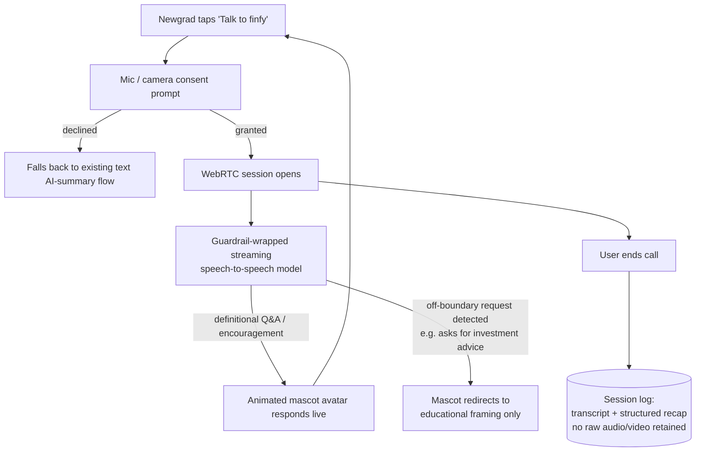

# feat: AI Video Call — finfy Mascot Live Session

> **Current status (2026-07-15):** Deferred. This is one of two secondary future use cases named in `docs/plans/origin.md` ("AI video call: finfy mascot with live AI video call feature like talking to a smart friend") and is explicitly **out of scope for the hackathon MVP** defined in that document's Scope Boundary section. No implementation has started. This document exists to give the idea a lightweight, reviewable technical shape so it isn't lost — not to greenlight build work.
>
> **Target repo:** Same repo as the finfy-literacy MVP; no separate repo or service is proposed. Expected to land as an additional optional client surface (plus a small new backend session-orchestration slice) once MVP retention and AI-summary engagement KPIs (see `docs/plans/finfy-literacy-phase-0-planning.md`) justify the investment.

## Summary

A live, low-friction way for a newgrad to talk to the finfy mascot instead of tapping through a challenge or reading a text summary — a browser-based voice (and optionally animated-avatar video) session that feels like a quick call with a knowledgeable, encouraging friend. Two intended moments: (1) a fast definitional lookup mid-challenge ("what does APR actually mean?") that today would require leaving the flow, and (2) a mid-streak check-in where the mascot offers encouragement rather than a static push notification. The mascot never gives licensed financial advice in this mode any more than it does in the text-based AI summary — it explains, encourages, and nudges toward the next challenge, and nothing else. This is a UX-warmth layer on top of the existing core loop (challenges, points, streaks, leaderboard), not a new core loop.

---

## Problem Frame

Tapping through menus to ask "what does this term mean" or to get a nudge to protect a streak is friction that a Duolingo-style challenge screen doesn't remove — it just gamifies the existing flow. A live voice/video session lowers the activation energy for exactly two things: quick definitional questions and emotional/motivational check-ins, both of which are naturally conversational rather than form-based. The risk is the opposite of the benefit: an open-ended live conversation is a much easier surface to accidentally slide into "personal financial advice" territory than a strict-format text summary is, so the problem this plan actually has to solve is *how to keep a live, less-scriptable surface inside the same boundaries the rest of the product already commits to*.

---

## Core Principles

These carry over from finfy-literacy's existing product stance (see Phase 0 planning and the AI-generated-summaries feature doc) and apply to this feature without modification.

1. **Never gives licensed financial advice, live or otherwise.** The mascot answers definitional and educational questions and offers encouragement; it does not recommend products, allocate money, or tell a user what to do with their paycheck. This is the same boundary the MVP's AI-generated summaries already commit to, applied to a harder, less-scriptable surface.
2. **Encouraging, not diagnostic.** The mascot's tone matches the strict-format text summaries: what you're doing well, one specific next step — never a clinical assessment of the user's financial standing.
3. **Patterns and nudges, not directives.** "You're on a 6-day streak — one more challenge keeps it alive" is in scope; "you should move your savings into X" is not.
4. **Additive, not a redesign of the core loop.** A call does not itself award points or change leaderboard position. It is an optional on-ramp back into challenges, not a parallel progression system.
5. **Consent-gated and minimal by default.** Mic (and camera, if used) access is requested explicitly per session; audio-only with an animated (non-camera) avatar is the default, not video calling with the user's own camera.
6. **Same MVP exclusions apply.** No bank/institution data access, no advanced analytics, no monetization — this feature inherits every out-of-scope item in `docs/plans/origin.md` rather than re-litigating them.

---

## Tech Stack Summary

Directional only — nothing here is pinned for implementation, since this feature is not scheduled. The intent is to show that a minimal version doesn't require new infrastructure families beyond what the MVP already needs.

| Layer | Choice | Version | Why |
|---|---|---|---|
| Client platform | Same mobile-first responsive web app as the MVP | — | No separate native app; reuses the decision in `mobile-first-design.md` instead of forking the client. |
| Real-time transport | WebRTC (browser `getUserMedia` + `RTCPeerConnection`) | — | Sub-second audio latency without a native app; works in mobile browsers. |
| Speech-to-speech model | Low-latency streaming voice model | vendor TBD | Needs live, interrupt-friendly turn-taking; the text-generation model used for AI summaries is not built for a "call" feel. Left unpinned — see Key Technical Decisions. |
| Avatar rendering | 2D viseme-driven animated mascot (sprite/Lottie-class asset) | — | Matches finfy's existing lightweight illustrated mascot; avoids a heavy 3D/photoreal avatar pipeline on mobile web. |
| Session orchestration | Thin WebSocket relay on the existing backend | — | Coordinates call setup/teardown and ties a session to the authenticated user; no new infrastructure family. |
| Guardrail layer | Same prompt/boundary spec as AI-generated summaries | — | One "no licensed financial advice" boundary to maintain, not two divergent ones. |
| Session logging | Structured transcript + short recap only | — | No raw audio/video retention; mirrors the strict-format precedent already set for text summaries. |

**Stack decisions intentionally rejected:**

- **Full 3D / photorealistic avatar** — too heavy for a mobile-first web app; contradicts the mobile-first design commitment.
- **Native iOS/Android app to unlock better real-time APIs** — the MVP stays web-first per `mobile-first-design.md`; revisit only if that decision itself flips.
- **Persistent voice-cloned memory of a user's financial history across sessions** — out of scope, mirrors the MVP's advanced-analytics exclusion.

**Stack decisions deferred (not rejected):**

- **Speech-to-speech model vendor.** Deliberately left unpicked. The market moves fast, the MVP hasn't shipped, and pinning a vendor now would rot before this feature is ever scheduled.
- **Audio-only vs. animated video avatar as the default.** A short design spike (Phase A below) should settle this before any UI is built.

---

## Cost Projection

Illustrative only — real-time voice/video APIs are typically billed per minute, and no vendor is chosen (see above), so treat the figures below as order-of-magnitude placeholders to be replaced once this feature is actually scheduled.

| Item | Assumption | Est. cost |
|---|---|---|
| Live voice session | Streaming speech-to-speech, illustrative $/min | placeholder — revisit at vendor selection |
| Sessions per active user / month | ~2 short (≤2 min) sessions, used as an occasional "ask the mascot" affordance, not a daily habit | — |
| Avatar rendering | Client-side (2D asset); negligible marginal cost | ~$0 |

**Threshold to revisit:** before committing to any vendor, re-derive this table against real per-minute pricing and finfy's actual DAU, and compare it against the cost of the existing AI-summary text pipeline (see `ai-generated-summaries.md`) — a live call session should not become the dominant line item in the product's inference spend for a feature that is, by design, secondary to the core loop.

---

## Requirements

- R1. A newgrad can start a live voice (optionally animated-avatar video) session with the finfy mascot from within the existing mobile-first web app.
- R2. The mascot must never produce licensed financial advice or product recommendations in a live session, enforced by the same guardrail spec used for AI-generated summaries, applied in real time.
- R3. Tone is encouraging and nudge-based, not diagnostic or directive, consistent with the existing strict-format summary tone.
- R4. A session is scoped to definitional/educational Q&A and streak/motivation check-ins; it must not request or accept real financial account data, consistent with the MVP's no-institution-integration boundary.
- R5. A session degrades gracefully to audio-only (or to the existing text-based AI-summary flow) if camera access or avatar rendering is unavailable or declined.
- R6. Session records are limited to a transcript and a short structured recap — no raw audio/video retention.
- R7. Explicit consent (mic, and camera if used) is required before every session, with an always-visible way to end the call.
- R8. This feature must not block or complicate the core MVP loop — it is reachable as an optional affordance from challenge and leaderboard screens, never a required step.

---

## Scope Boundaries

- No licensed financial advice, planning tools, or product recommendations delivered via the mascot — inherits the MVP-wide exclusion from `docs/plans/origin.md`.
- No bank/institution data access inside a call.
- No persistent voice profile or long-term memory of a user's financial history beyond the current session.
- No native iOS/Android app required — browser-based only, consistent with the MVP's mobile-first web decision.
- No monetization tied to call minutes at this stage.
- Not scheduled. This entire document is pre-MVP-launch planning, not an approved build — see Current status above.

### Deferred to Follow-Up Work

- Vendor selection and integration for the streaming speech-to-speech model.
- Avatar design spike (2D animated sprite vs. audio-only with a motion/waveform treatment) with the design team.
- Adapting this same feature for the high-school-student secondary use case named in `docs/plans/origin.md`, with an adjusted, more moderated tone.
- A group/multiplayer call variant (e.g., the mascot hosting a small peer cohort) — purely speculative, no signal yet that this is wanted.

---

## Context & Research

### Relevant Code and Patterns

- No real-time voice/video code exists in this repo yet. The closest existing pattern to reuse is the strict-format guardrail/prompt approach described in `docs/plans/features/ai-generated-summaries.md`; the live session's guardrail layer should extend that spec rather than write a second, divergent one.

### Institutional Learnings

- None yet — this is a pre-implementation planning document and no build has started against it.

### External References

- Vendor and API documentation for a specific streaming speech-to-speech model, WebRTC implementation guides, and avatar-rendering libraries are intentionally not pinned here, since vendor selection is deferred (see Scope Boundaries). Add current references here when this feature is actually scheduled.

---

## Key Technical Decisions

- **Reuse the AI-generated-summaries guardrail/tone spec rather than writing a new one.** One "no licensed financial advice" boundary to maintain across the product, not two that can drift apart.
- **Browser-based (WebRTC), not a native app.** Consistent with the MVP's mobile-first responsive web app decision; revisit only if that underlying decision changes.
- **Leave the speech-to-speech model vendor unpinned.** The feature isn't scheduled, and pinning a fast-moving model choice this early would be stale before implementation starts.
- **Prefer a lightweight 2D animated mascot over a photorealistic 3D/video avatar.** Matches finfy's existing illustrated brand and keeps mobile bandwidth/render cost low.
- **Data-minimize session records by default.** Transcript plus structured recap only, no raw media retention — mirroring the strict-format precedent already set for text summaries.
- **Treat this as a secondary entry point into the existing core loop, not a parallel surface.** No new scoring or ranking mechanics are introduced.

### Approach comparison: self-hosted session vs. managed real-time-avatar platform

| | Self-hosted (own model + WebRTC) | Managed real-time avatar platform |
|---|---|---|
| Control over guardrails/tone | Full — same prompt/classifier layer as the rest of the product | Partial — depends on the vendor's own moderation hooks |
| Time to first working demo | Slower | Faster |
| Cost visibility | Usage-based on the underlying model, more transparent | Often bundled with markup, less transparent |
| Vendor lock-in | Lower | Higher |
| Fit with finfy's current MVP posture | Only once there's room to invest beyond the MVP | Reasonable if this ever ships as a fast, throwaway spike |

Neither option is chosen here — this table exists to frame the trade-off for whoever picks this plan back up.

---

## Open Questions

### Resolved During Planning

- *Native app vs. browser?* — Browser-based, inheriting the MVP's mobile-first web decision. Revisit only if that decision itself changes.
- *Default modality?* — Audio-only with an animated avatar by default; camera video is optional and off by default.

### Deferred to Implementation

- Which speech-to-speech vendor to integrate, and at what real per-minute cost.
- Whether the guardrail layer needs a live-specific addition (e.g., an interrupt/redirect behavior) beyond what the text-summary prompt spec already provides.
- Whether session recaps should feed into the same "next step" mechanism as post-challenge AI summaries, or stay a separate, lighter-weight record.
- Whether this feature should be gated behind a minimum streak/engagement threshold, or open to all users from day one of its own rollout.

---

## Output Structure

Illustrative only — no frontend scaffold exists yet for this feature; folder names below are placeholders for when it is actually scheduled.

```
finfy-literacy/
└── apps/
    └── web/
        └── src/
            └── features/
                └── mascot-call/              # not yet created
                    ├── CallButton.tsx         # entry point from challenge/leaderboard screens
                    ├── CallSession.tsx        # WebRTC session UI, consent flow, live avatar
                    ├── useMascotSession.ts    # session lifecycle (connect / end / reconnect)
                    ├── guardrail-prompt.md    # shared boundary spec, sourced from ai-generated-summaries
                    └── session-log.ts         # transcript + structured recap only, no raw media
```

---

## High-Level Technical Design

> *Directional guidance only — this feature has no implementation, and this diagram is not a build spec.*



State machine for a single session:

```
idle → consent_requested ──(granted)──► connecting → live → ended → logged
                          └─(declined)─► text_fallback

live ──(network drop)──► reconnecting ──► live | ended
```

---

## Implementation Units

Deliberately lightweight — this is a forward-looking plan, not a build ticket set. Units below are directional groupings, not committed scope.

### Phase A — Validate the concept (spike, pre-commitment)

- U1. **Guardrail reuse spike.** Test whether the AI-generated-summaries guardrail/tone spec holds up against live, adversarial, less-scriptable input before any UI work starts. This is the single highest-risk unknown in the whole feature.
- U2. **Avatar direction spike.** A short design exploration (2D animated sprite vs. audio-only with a motion treatment) with the design/mascot art team. Output is a decision, not shipped code.

### Phase B — Minimal live session (only if Phase A is greenlit)

- U3. **WebRTC session shell.** Consent flow, connect/end call UI, wired into the existing mobile-first web client as a new optional entry point from challenge and leaderboard screens.
- U4. **Streaming voice integration.** Wire the chosen speech-to-speech vendor behind the guardrail layer validated in U1, scoped to definitional Q&A and streak encouragement only.
- U5. **Session logging.** Structured transcript/recap persistence with no raw media retention, reusing the strict-format precedent from AI-generated summaries.

### Phase C — Hardening and expansion (later)

- U6. **Abuse/misuse monitoring.** Review sessions where the guardrail redirected an off-boundary request; feed patterns back into prompt tuning.
- U7. **Secondary-use-case adaptation.** Evaluate porting this feature to the high-school-student use case named in `docs/plans/origin.md`, with an adjusted tone.

---

## System-Wide Impact

- **Interaction graph:** A new optional module reachable from challenge and leaderboard screens. Reads the existing user/auth and points/streak data models; does not write to them — a live call does not itself award points.
- **Error propagation:** A failed, declined, or unsupported session falls back to the existing text-based AI-summary flow; it never blocks the core challenge loop.
- **Concurrency / state:** One session per user at a time; no cross-user or multiplayer state in this phase.
- **Unchanged invariants:** Points, streaks, and leaderboard ranking rules are untouched — this feature is additive, not a redesign of the core loop.

---

## Risks & Dependencies

| Risk | Likelihood | Impact | Mitigation |
|---|---|---|---|
| A live, less-scriptable surface produces something that reads as licensed financial advice | Med | High | Reuse the AI-generated-summaries guardrail boundary; redirect off-boundary requests to educational framing; validate this in the Phase A spike before any UI work. |
| Real-time voice/video model cost scales unpredictably with usage | Med | Med | Keep sessions short and purpose-scoped; re-derive Cost Projection once a vendor and real usage pattern exist. |
| The mascot ends up with two inconsistent "voices" (live vs. strict-format text) | Med | Med | Source live-session tone from the same guardrail/tone spec as the text summaries, not a separately written persona. |
| Mic/camera permission friction on mobile web reduces adoption | Med | Low | Default to audio-only with a non-camera animated avatar; treat webcam as optional, never required. |
| Effort here diverts from validating the actual MVP core loop | Low (guarded by this doc's deferred status) | High | This document is explicitly deferred; do not schedule implementation before MVP KPIs (Phase 0 planning) show the core loop working. |

---

## Documentation / Operational Notes

- No setup or README section exists yet — this feature has no code. When scheduled, document mic/camera consent copy alongside the existing onboarding flow.
- Any change to the guardrail prompt must be mirrored to (or explicitly and deliberately diverged from) the AI-generated-summaries prompt, since both surfaces make the same "no licensed financial advice" promise.
- No telemetry beyond the structured session log (transcript + recap) is planned; align with whatever privacy/consent copy the onboarding flow ships with.

---

## Sources & References

- Plan file: `docs/plans/voice-wiki.md` (this document; formerly an unrelated voice-journaling CLI plan inherited from a prior product, repurposed 2026-07-15 for finfy-literacy's AI video call concept).
- `docs/plans/origin.md` — names this as a secondary, out-of-MVP-scope use case.
- `docs/plans/finfy-literacy-phase-0-planning.md` — KPIs and user journey this feature would need to move.
- `docs/plans/features/ai-generated-summaries.md` — source of the strict-format tone and guardrail precedent this feature reuses.
- `docs/plans/features/mobile-first-design.md` — source of the "mobile-first responsive web app, not native" decision this feature inherits.
